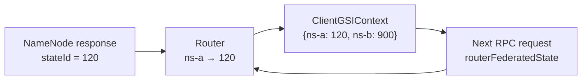
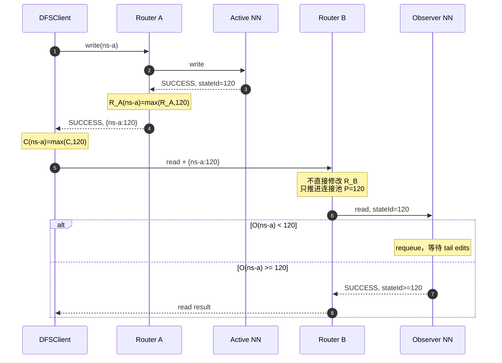
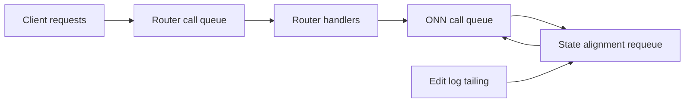

> 本文讨论的是 **Router-Based Federation（RBF）架构下，客户端经 Router 访问 Observer NameNode（ONN）** 的读一致性实现。早期单个 HA nameservice 中由客户端直接使用 `ObserverReadProxyProvider` 访问 ONN 的机制，只作为基础背景，不是本文主体。
>
> 本文代码基于 Apache Hadoop 3.4.1 官方版本，文中的代码片段为便于阅读而简化的等价伪代码。

## 1\. RBF Observer Read 的一致性问题

Observer NameNode 通过持续 tail edits，把 Active NameNode（ANN）已经提交的 namespace 变更应用到自己的内存状态。它不处理写请求，也不会产生尚未提交的 namespace 状态，所以这里主要面对的是 **陈旧读（stale read）**，而不是数据库语境中的脏读。

真正的问题是：

> 当一个客户端刚刚完成写操作，或已经从 ANN 观察到某个 namespace 状态后，后续读被 Router 转发给 ONN 时，如何证明 ONN 至少已经应用到客户端所观察过的状态？

在单个 HA nameservice 中，可以用一个全局 state ID 表达这个下限。进入 RBF 后，问题明显复杂了：

- 一个 Router 后面可能连接多个 nameservice；
- 不同 nameservice 的 edit log 和 state ID 彼此独立；
- 客户端可能在多个 Router 之间切换；
- Router 还会为不同用户和下游 NameNode 维护不同的连接池；
- 不能把任意客户端上报的 state ID 直接当成 Router 的全局可信状态。

因此，Hadoop 3.4.1 没有试图把所有 Router 同步成一个全局一致的状态机，而是采用了一条更轻量的路径：

> Router 将各 namespace 的已知 state ID 返回给客户端；客户端在后续请求中带回这些状态；Router 再把目标 namespace 的客户端状态作为 ONN 读下限。

这套机制的目标是 **客户端因果一致性**，而不是全局线性一致性。

## 2\. 一致性模型

为便于后续分析，定义四类状态：

| 符号         | 对应实现                                | 含义                                           |
| ------------ | --------------------------------------- | ---------------------------------------------- |
| `C(ns)`      | `ClientGSIContext.routerFederatedState` | 客户端已经观察到的 namespace 状态              |
| `R(ns)`      | `RouterStateIdContext.namespaceIdMap`   | 当前 Router 从 NameNode 成功响应中确认过的状态 |
| `P(ns,u,nn)` | `PoolAlignmentContext.poolLocalStateId` | 某个下游连接池向 NameNode 提出的最低状态要求   |
| `O(ns)`      | ONN 的 `lastAppliedOrWrittenTxId`       | Observer 已经应用的 namespace 状态             |

一次 coordinated ONN read 能执行的核心条件是：

```text
O(ns) >= P(ns,u,nn)
```

而 `P` 至少吸收当前客户端携带的 `C(ns)`：

```text
P := max(P, C(ns))
```

因此，对同一个 `DFSClient / ClientGSIContext`，可以得到：

```text
后续成功读所依赖的 ONN 状态
    >= 客户端此前已经观察到的状态
```

这给出了两个重要性质：

1.  **Read-your-writes**：同一客户端成功写后，后续读不能退回到写前状态。
2.  **Monotonic reads**：同一客户端后续读不能比此前已经观察到的状态更旧。

但它没有承诺：

```text
任何客户端的每次读 == ANN 当前最新状态
```

其他客户端刚刚提交、但当前客户端和当前 Router 都尚未观察到的写入，仍可能在一个刷新窗口内不可见。

## 3\. 协议与四层 State ID

Hadoop IPC 原本已经有一个标量字段：

```protobuf
optional int64 stateId;
```

它足以表达单个 HA nameservice 的状态。但 RBF Router 后面可能有多个 namespace，单个 long 无法表达：

```text
ns-a -> 100
ns-b -> 900
ns-c -> 42
```

因此，RPC header 又增加了：

```protobuf
optional bytes routerFederatedState;
```

其内容本质上是：

```text
Map<nameserviceId, stateId>
```

请求和响应都可以携带这个字段：



相关协议定义见 [RpcHeader.proto](https://github.com/apache/hadoop/blob/rel/release-3.4.1/hadoop-common-project/hadoop-common/src/main/proto/RpcHeader.proto)。

**客户端状态：`ClientGSIContext`**

客户端收到普通 NameNode 响应时，更新标量 `lastSeenStateId`；收到 Router 响应时，则按 namespace 合并 `routerFederatedState`：

```java
// 等价伪代码
if (response.hasRouterFederatedState()) {
  for (namespace, state : response.federatedState) {
    clientState[namespace] = max(clientState[namespace], state);
  }
} else {
  lastSeenStateId = max(lastSeenStateId, response.stateId);
}
```

下次请求会把已经保存的 federated state 放回 RPC header。

这里必须使用 `max` 合并，而不能让来自不同 Router 的响应相互覆盖。假设客户端先从 Router A 获得 `{ns-a: 120}`，又从状态较旧的 Router B 收到 `{ns-a: 110}`，客户端必须继续保持 120。这个行为由 [HDFS-16837 / PR #5123](https://github.com/apache/hadoop/pull/5123) 修正。

源码见 [ClientGSIContext.java](https://github.com/apache/hadoop/blob/rel/release-3.4.1/hadoop-hdfs-project/hadoop-hdfs-client/src/main/java/org/apache/hadoop/hdfs/ClientGSIContext.java)。

**Router 全局状态：`RouterStateIdContext`**

每个 Router 维护：

```text
namespaceIdMap: namespace -> max state observed from NameNode
```

最重要的不变量是：

> `R(ns)` 只能由 NameNode 的成功 RPC 响应推进，不能由客户端请求直接推进。

等价逻辑如下：

```java
// Router 作为下游 NameNode 的 IPC client
onSuccessfulNameNodeResponse(ns, responseStateId) {
  routerGlobalState[ns] =
      max(routerGlobalState[ns], responseStateId);
}

// Router 作为上游客户端的 IPC server
onClientRequest(clientFederatedState) {
  // 不写 routerGlobalState
}
```

这是信任边界：NameNode 响应是 Router 可以验证的事实；客户端上报的值只是该客户端声明的读取下限。

源码见 [RouterStateIdContext.java](https://github.com/apache/hadoop/blob/rel/release-3.4.1/hadoop-hdfs-project/hadoop-hdfs-rbf/src/main/java/org/apache/hadoop/hdfs/server/federation/router/RouterStateIdContext.java)。

**连接池状态：`PoolAlignmentContext`**

客户端状态虽然不能污染 Router 全局状态，但不能被丢弃，否则会破坏跨 Router 的 read-your-writes。

Router 获取下游连接时，会从当前 RPC 的 federated state 中取出目标 namespace 的值：

```java
// 等价伪代码
clientState = currentCall.federatedState.getOrDefault(
    namespace, NO_STATE);
poolLocalState = max(poolLocalState, clientState);
```

随后 Router→NameNode 的请求使用 `poolLocalStateId`：

```java
requestHeader.stateId = poolLocalStateId;
```

这个逻辑由 [HDFS-16826 / PR #5086](https://github.com/apache/hadoop/pull/5086) 补齐：无论连接池是刚创建还是已经存在，每个请求都必须推进客户端 state。

而 [HDFS-16834 / PR #5121](https://github.com/apache/hadoop/pull/5121) 明确拆开了：

- `sharedGlobalStateId`：只接受 NameNode 响应；
- `poolLocalStateId`：接受客户端观察状态。

这样，一个客户端的状态不会直接成为 Router 全局事实，也不会无条件阻塞其他连接池。

源码见：

- [PoolAlignmentContext.java](https://github.com/apache/hadoop/blob/rel/release-3.4.1/hadoop-hdfs-project/hadoop-hdfs-rbf/src/main/java/org/apache/hadoop/hdfs/server/federation/router/PoolAlignmentContext.java)
- [ConnectionManager.java](https://github.com/apache/hadoop/blob/rel/release-3.4.1/hadoop-hdfs-project/hadoop-hdfs-rbf/src/main/java/org/apache/hadoop/hdfs/server/federation/router/ConnectionManager.java)

**NameNode 真实状态：`GlobalStateIdContext`**

ANN 和 ONN 的 RPC server 都可以安装 `GlobalStateIdContext`。响应时，它把本机的：

```text
lastAppliedOrWrittenTxId
```

写入 response header。

对于 ANN，这表示其当前已写状态；对于 ONN，这表示其当前已应用状态。Router 只有在成功收到响应后，才用这个值推进 `R(ns)`。

源码见 [GlobalStateIdContext.java](https://github.com/apache/hadoop/blob/rel/release-3.4.1/hadoop-hdfs-project/hadoop-hdfs/src/main/java/org/apache/hadoop/hdfs/server/namenode/GlobalStateIdContext.java)。

## 4\. 写后读闭环

假设客户端通过 Router A 在 `ns-a` 完成一次写，ANN 写后 state ID 为 120；随后客户端切换到 Router B 发起读。



这里没有 Router A→Router B 的状态同步。跨 Router 一致性来自客户端携带的 `{namespace: stateId}`。

因此，“Router A 写、Router B 读”不能简单判定为陈旧读；真正的判断条件是：

> 是否复用了同一个 `DFSClient / ClientGSIContext`。

如果应用重建了客户端，或读写由两个完全独立的客户端完成，那么写端观察到的 state 不会自动传到读端。

**HDFS-17156：状态发布必须先于 RPC 成功返回**

仅仅在响应中携带 state ID 还不够。IPC Client 内部还存在一个并发顺序要求：

```java
// 正确顺序的等价伪代码
alignmentContext.receiveResponseState(header);
call.complete(response);
```

如果顺序反过来：

```java
call.complete(response);                    // 唤醒业务线程
alignmentContext.receiveResponseState(...); // 稍后更新 state
```

就会出现竞态：

1.  写 RPC 已经向业务线程返回成功；
2.  业务线程立即发起 ONN 读；
3.  客户端 state 尚未从写响应中更新；
4.  新读携带旧 state，可能读到写前结果。

[HDFS-17156 / PR #5951](https://github.com/apache/hadoop/pull/5951) 将 state 接收放到唤醒调用者之前，使“写成功返回”同时成为 state 已发布的 happens-before 边界。

源码见 [Client.java](https://github.com/apache/hadoop/blob/rel/release-3.4.1/hadoop-common-project/hadoop-common/src/main/java/org/apache/hadoop/ipc/Client.java)。

## 5\. Router 路由与 ONN 对齐

Router 并不是只要方法可读就永远选择 ONN。3.4.1 的核心条件可简化为：

```java
observerFirst =
    methodIsObserverReadable
    && namespaceStateIsFresh
    && clientCarriesStateFor(namespace);
```

如果条件不满足，Router 将这次实际读直接路由到 ANN，而不是先向 ANN `msync`、再到 ONN 读。

这带来一个很重要的启动行为：

```text
客户端第一次读：
    没有 namespace state
    → 实际读走 ANN
    → 从响应中获得 federated state

后续读：
    客户端已经携带 namespace state
    → 可以优先走 ONN
```

源码见 [RouterRpcClient.java](https://github.com/apache/hadoop/blob/rel/release-3.4.1/hadoop-hdfs-project/hadoop-hdfs-rbf/src/main/java/org/apache/hadoop/hdfs/server/federation/router/RouterRpcClient.java)。

**周期 Active refresh**

配置：

```xml
<name>dfs.federation.router.observer.state.id.refresh.period</name>
<value>15s</value>
```

当 Router 认为某 namespace 距离上次 Active 调用已经超过刷新周期时，下一次实际读会优先访问 ANN。ANN 的响应既返回本次读结果，也刷新 Router 和客户端的 state。

这个机制由 [HDFS-16890 / PR #5298](https://github.com/apache/hadoop/pull/5298) 引入，解决的是：

> 当前 Router 和当前客户端都没有观察到的外部写入，不能永远被 ONN 旧状态遮蔽。

但它仍然不是线性一致性屏障：

- 在 refresh period 内，其他客户端的最新写可能暂时不可见；
- 刷新时间在路由到 Active 时更新，并不是一个“Active 响应成功后才提交”的严格 barrier；
- 并发过期请求也不应被理解为全局 single-flight 刷新。

因此，它更准确的定位是 **有界发现机制**，而不是“所有读都追到 ANN 最新 txid”的证明。

**ONN 的执行、Requeue 与拒绝路径**

ONN 收到 coordinated read 后，先由 `GlobalStateIdContext` 检查请求 state。

**请求没有 state ID**

如果 Observer 收到没有 state ID 的请求，它不能证明客户端允许读取到哪个历史位置，因此抛出 `StandbyException`，让请求离开 Observer 路径。

**Observer 只是小幅落后**

当客户端 state 在可等待范围内，RPC 被标记为 coordinated call。Handler 从 call queue 取出请求时检查：

```java
// 等价伪代码
if (call.clientStateId > observer.lastAppliedStateId) {
  requeue(call);
  continue;
}
execute(call);
```

这不是线程在原地 sleep，而是重新入队，等待 edit tailer 推进 ONN state 后再次调度。

源码见 [Server.java](https://github.com/apache/hadoop/blob/rel/release-3.4.1/hadoop-common-project/hadoop-common/src/main/java/org/apache/hadoop/ipc/Server.java)。

**Observer 落后过多**

如果根据 RPC 最大等待时间和估算事务速率判断 ONN 不可能及时追上，`GlobalStateIdContext` 抛出 `RetriableException`。

这里要区分两类异常：

- `RetriableException`：当前 Router RPC 会向上层返回可重试错误，由外层 retry/failover 策略决定下一步；
- `ObserverRetryOnActiveException`：Router 明确停止尝试 Observer，直接转向 Active。

不能把所有“Observer 落后”都描述为 Router 在同一次调用中必然自动 fallback ANN。

## 6\. 一致性场景与边界

| 场景                                            | 3.4.1 行为                                   | 保证                                                           |
| ----------------------------------------------- | -------------------------------------------- | -------------------------------------------------------------- |
| 同一 Router、同一客户端成功写后读               | 写响应推进客户端 `C(ns)`，后续读携带该 state | 保证 read-your-writes                                          |
| 同一 Router、同一客户端任意成功 Active RPC 后读 | 成功 Active 响应同样推进 state               | 后续读不早于已观察状态                                         |
| Router A 写、Router B 读，同一客户端            | 客户端把 federated state 从 A 带到 B         | 不依赖 Router 间同步，仍可保证写后读                           |
| 直连 ANN 写，再新建 Router 客户端读             | 两个客户端上下文通常不共享 state             | 新客户端首次读通常走 ANN；已有旧状态客户端可能在刷新窗口内陈旧 |
| 其他客户端写，当前客户端读                      | 当前客户端不知道对方写后的 state             | 不保证立即最新，依赖后续 Active 观察或周期 refresh             |

由此可以得到一个简洁边界：

```text
同一 ClientGSIContext：
    保证自己已经观察过的状态不会丢失

不同 ClientGSIContext：
    不保证立即观察到对方的最新写
```

**响应头 state 可能领先于本次读结果**

假设另一个客户端刚通过当前 Router 完成写入，使 `R(ns)=120`；当前读客户端只携带 `C(ns)=100`，而 ONN 已应用到 105。该 ONN 已满足当前请求的下限，因此可以返回基于 105 的结果。与此同时，Router 响应头可能把全局已知的 120 返回给客户端。

于是：

```text
本次读结果可能只反映 state 105
响应结束后客户端 state 被推进到 120
下一次 coordinated read 必须等待 ONN >= 120
```

因此，Router 返回的 federated state 更准确地说是 **供后续请求使用的一致性下限**，不能机械地理解成“本次响应数据必然来自该 state 的完整快照”。

**客户端 state 大于 Router state**

假设：

```text
Router B: R(ns-a)=100
Client:   C(ns-a)=120
ONN:      O(ns-a)=115
```

Router B 的处理是：

```text
R(ns-a) 保持 100
P(ns-a,u,nn) 推进到 120
Router→ONN 请求携带 stateId=120
```

这正是跨 Router 写后读所需要的：Router B 即使还没有亲自观察到 120，也必须尊重客户端提出的读取下限。

但 Router 不能把 120 直接写入全局 `R(ns-a)`，因为客户端输入不是可信的全局事实。只有当某个 NameNode 成功返回真实 state 后，Router 才能推进 `R(ns-a)`。

**连接池 poisoning 边界**

这项设计也有一个明确风险：`poolLocalStateId` 只增不减，而且客户端值没有先与 Router 全局 state 做上限校验。恶意或异常客户端如果携带极大的未来 state，可能使相关连接池后续请求持续携带该值：

- ONN 判断自己严重落后并返回可重试错误；
- 请求产生额外重试或 Active 压力；
- 共享相同 UGI/token 和目标 NameNode 连接池的请求可能受到影响。

不过，该值不会污染 Router 全局 `namespaceIdMap`，也不会直接扩散到所有用户的连接池。这是安全性与跨 Router 因果一致性之间的显式权衡。

## 7\. federated state 如何减少每次读前 `msync`

传统的保守路径是：

```text
Client → Router → ANN msync → ONN read
```

每个逻辑读都被扩展为两个串行下游 RPC：

- ANN 仍然承担 handler、call queue、网络和指标更新开销；
- Router handler 必须等待 `msync + ONN read`；
- ONN requeue 时，Router handler 的占用时间进一步延长；
- 高峰期容易形成 Router 和 ONN 的排队放大。

federated state 路径则是：

```text
Client → Router → ONN read(stateId=C)
```

只有在客户端没有 state、Router state freshness 过期，或发生明确 fallback 时才访问 ANN。

这不是取消一致性，而是把一致性屏障从“每次额外调用 ANN”转换为：

```text
客户端携带因果下限
    +
ONN 服务端验证自身是否追平
```

官方配置文档也明确说明：传播 federated state 可以避免每个 read 都执行 `msync`，代价是 RPC header 随 namespace 数量增大。见 [hdfs-rbf-default.xml](https://github.com/apache/hadoop/blob/rel/release-3.4.1/hadoop-hdfs-project/hadoop-hdfs-rbf/src/main/resources/hdfs-rbf-default.xml)。

需要注意，3.4.1 仍保留客户端侧 `RouterObserverReadProxyProvider` 的 auto-msync 能力：

```text
period < 0：不自动 msync，默认值
period = 0：每个 read 前 msync
period > 0：按周期 msync
```

它是额外的客户端策略，不是 RBF federated state 主链路必须依赖的步骤。

## 8\. 配置与边界

| 配置                                                                 | 3.4.1 默认值 | 作用                                                |
| -------------------------------------------------------------------- | -----------: | --------------------------------------------------- |
| `dfs.namenode.state.context.enabled`                                 |      `false` | NameNode 是否在 RPC 中处理和返回 state ID           |
| `dfs.federation.router.observer.read.default`                        |      `false` | Router 是否默认允许 namespace 走 Observer read      |
| `dfs.federation.router.observer.read.overrides`                      |           空 | 按 namespace 反转默认策略                           |
| `dfs.client.rbf.observer.read.enable`                                |      `false` | 普通 RBF client proxy 是否安装 `ClientGSIContext`   |
| `dfs.federation.router.observer.federated.state.propagation.maxsize` |          `5` | Router 最多传播多少个 namespace state               |
| `dfs.federation.router.observer.state.id.refresh.period`             |        `15s` | 多久让实际调用重新优先访问 Active                   |
| `dfs.client.failover.observer.auto-msync-period.<ns>`                |         `-1` | 特殊 Router observer proxy 的客户端 auto-msync 周期 |

其中最容易被忽略的是 propagation max size。

当 Router 保存的 namespace 数量超过该阈值时，它不会继续把完整 federated state 放入响应。若客户端已经保存旧 map，它可能继续携带旧状态；新写后的 state 又无法传播回来，跨 Router read-your-writes 的前提就会被破坏。

因此：

> `federated.state.propagation.maxsize` 不是单纯的 header 优化参数，它参与一致性能力是否完整生效。

## 9\. 生产观测：不要只盯 ONN QPS

RBF Observer read 的性能问题通常是一条排队链：



建议至少同时观测：

- Router client-facing call queue 和 handler 使用量；
- Router→ANN、Router→ONN 的调用量与延迟；
- ONN `RequeueCalls`；
- `RpcQueueTimeNumOps` 与 `RpcProcessingTimeNumOps` 的差异；
- ANN last written txid 与 ONN last applied txid 的差值；
- edit tail 周期、单次 tail 延迟和异常；
- Active refresh 和显式 `msync` 的调用比例；
- RPC percentile/quantile 指标在高 QPS 下的同步更新成本。

`RpcQueueTimeNumOps` 明显高于 `RpcProcessingTimeNumOps` 时，不能简单解释为“请求处理很慢”。Coordinated call 每次 requeue 都会产生额外排队尝试，但并不对应一次真正的业务方法执行。

## 10\. 关键 Apache 演进

RBF Observer read 不是一个 PR 一次完成的功能，关键演进包括：

1.  [HDFS-12943](https://issues.apache.org/jira/browse/HDFS-12943) / [HDFS-12976](https://issues.apache.org/jira/browse/HDFS-12976)：建立单 nameservice Observer read、state ID 和客户端代理基础。
2.  [HDFS-16767 / PR #4127](https://github.com/apache/hadoop/pull/4127)：Router 可以识别并优先调用 Observer。
3.  [HDFS-13522 / PR #4311](https://github.com/apache/hadoop/pull/4311)：增加 federated namespace state，并在 Router 与客户端之间传播。
4.  [HADOOP-18406 / PR #4748](https://github.com/apache/hadoop/pull/4748)：把 alignment context 接入多连接 RPC proxy 创建链路。
5.  [HDFS-16826 / PR #5086](https://github.com/apache/hadoop/pull/5086)：每个请求都必须推进连接池的客户端 state。
6.  [HDFS-16834 / PR #5121](https://github.com/apache/hadoop/pull/5121)：拆分 Router 全局可信状态与连接池客户端状态。
7.  [HDFS-16837 / PR #5123](https://github.com/apache/hadoop/pull/5123)：客户端按 namespace 合并多个 Router 返回的最大 state。
8.  [HDFS-16890 / PR #5298](https://github.com/apache/hadoop/pull/5298)：增加周期 Active state refresh。
9.  [HDFS-17156 / PR #5951](https://github.com/apache/hadoop/pull/5951)：保证 state 发布先于 RPC 调用线程被唤醒。

这些修复共同说明：分布式一致性往往不只在“核心算法”里。连接池复用、响应完成顺序、跨 Router 合并和刷新失败路径，都会决定设计是否真正闭环。

## 11\. 总结

Hadoop 3.4.1 的 RBF Observer read 可以浓缩为三个不变量：

**不变量一：客户端状态是读取下限**

```text
后续 ONN read 不得早于同一客户端已经观察到的 namespace state。
```

**不变量二：Router 全局状态只能由 NameNode 证明**

```text
客户端 state 可以推进 pool-local requirement，
但不能直接推进 Router global state。
```

**不变量三：ONN 在服务端完成最终校验**

```text
Observer 未追平时，读请求 requeue 或失败；
不能绕过 state alignment 直接返回旧结果。
```

这套设计最精妙的地方，不是消灭了 state 同步成本，而是改变了同步发生的位置：

- 不再要求每个读都先额外访问 ANN；
- 客户端负责携带自己的因果历史；
- Router 负责在多 namespace 和连接池之间隔离可信状态与客户端要求；
- ONN 负责证明自己是否已经追平。

它提供的是高扩展性的 read-your-writes 与 monotonic reads，而不是跨客户端、跨 Router 的全局线性一致性。理解这条边界，才能正确评估 `msync`、refresh period、ONN lag 与 Router call queue 之间的取舍。

## 参考源码

- [Apache Hadoop 3.4.1 source tree](https://github.com/apache/hadoop/tree/rel/release-3.4.1)
- [ClientGSIContext.java](https://github.com/apache/hadoop/blob/rel/release-3.4.1/hadoop-hdfs-project/hadoop-hdfs-client/src/main/java/org/apache/hadoop/hdfs/ClientGSIContext.java)
- [RouterStateIdContext.java](https://github.com/apache/hadoop/blob/rel/release-3.4.1/hadoop-hdfs-project/hadoop-hdfs-rbf/src/main/java/org/apache/hadoop/hdfs/server/federation/router/RouterStateIdContext.java)
- [PoolAlignmentContext.java](https://github.com/apache/hadoop/blob/rel/release-3.4.1/hadoop-hdfs-project/hadoop-hdfs-rbf/src/main/java/org/apache/hadoop/hdfs/server/federation/router/PoolAlignmentContext.java)
- [ConnectionManager.java](https://github.com/apache/hadoop/blob/rel/release-3.4.1/hadoop-hdfs-project/hadoop-hdfs-rbf/src/main/java/org/apache/hadoop/hdfs/server/federation/router/ConnectionManager.java)
- [RouterRpcClient.java](https://github.com/apache/hadoop/blob/rel/release-3.4.1/hadoop-hdfs-project/hadoop-hdfs-rbf/src/main/java/org/apache/hadoop/hdfs/server/federation/router/RouterRpcClient.java)
- [GlobalStateIdContext.java](https://github.com/apache/hadoop/blob/rel/release-3.4.1/hadoop-hdfs-project/hadoop-hdfs/src/main/java/org/apache/hadoop/hdfs/server/namenode/GlobalStateIdContext.java)
- [Hadoop IPC Client.java](https://github.com/apache/hadoop/blob/rel/release-3.4.1/hadoop-common-project/hadoop-common/src/main/java/org/apache/hadoop/ipc/Client.java)
- [Hadoop IPC Server.java](https://github.com/apache/hadoop/blob/rel/release-3.4.1/hadoop-common-project/hadoop-common/src/main/java/org/apache/hadoop/ipc/Server.java)
- [TestObserverWithRouter.java](https://github.com/apache/hadoop/blob/rel/release-3.4.1/hadoop-hdfs-project/hadoop-hdfs-rbf/src/test/java/org/apache/hadoop/hdfs/server/federation/router/TestObserverWithRouter.java)

Welcome to my other publishing channels

[GitHub](https://github.com/zouhuajian)
