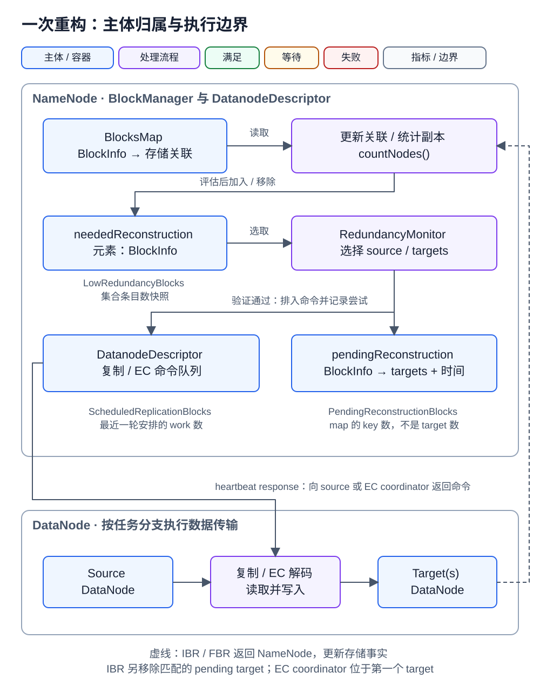
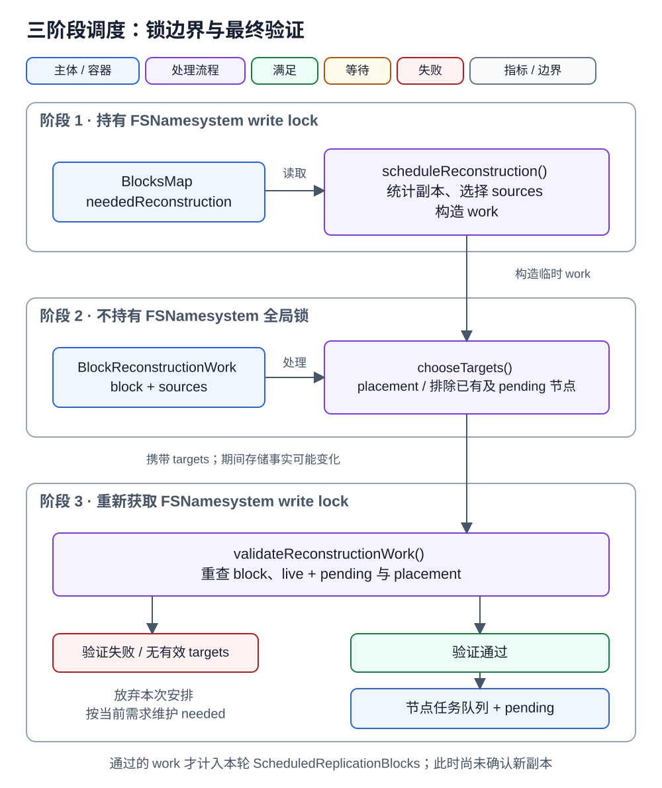
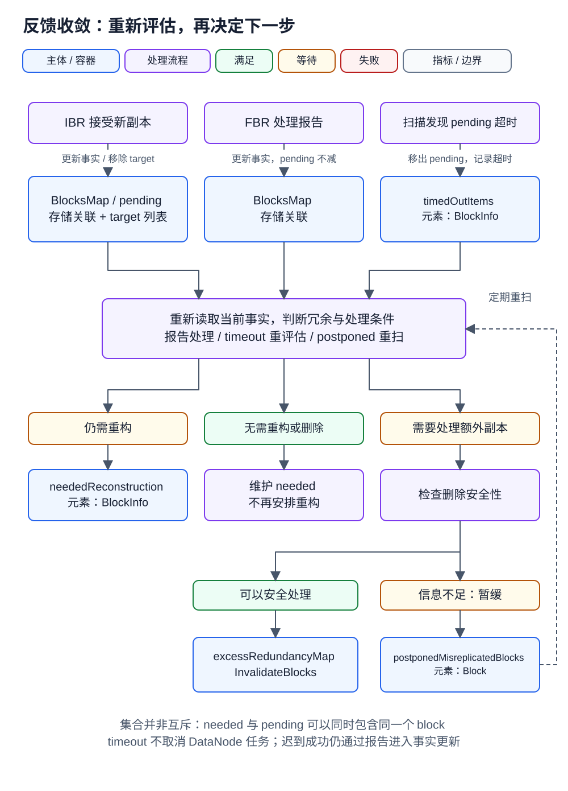

> 本文源码基于 Apache Hadoop 3.4.1
>
> 本文分析已完成写入的 block 如何恢复冗余。写入期间的 pipeline recovery、lease recovery 和 `BlockRecoveryWorker` 不在本文范围内。

HDFS 的 block reconstruction 是一个持续收敛的过程：NameNode 根据当前 replica 事实识别需求、选择工作，DataNode 执行复制或 EC 解码，再通过 block report 反馈结果。阅读这条链路时，需要始终区分 **逻辑 block、实际 replica、调度记录和执行任务**；它们的数量并不相等。

本文先用一个 block 串起全链路，再依次解释冗余判定、三阶段调度、DataNode 执行和失败收敛。每个核心容器旁边给出关联指标，最后提供指标与配置速查表。

## 1. 一次重构涉及哪些主体

### 1.1 从 block B 丢失两份副本开始

假设普通 block `B` 的 replication factor 为 3，原来位于 `DN1 / DN2 / DN3`；`DN2 / DN3` 故障并被 NameNode 处理后，只剩 `DN1` 上的一份 live replica。

1. `BlockManager` 重新统计 B，将它加入 `neededReconstruction` 的最高优先级集合。
2. `RedundancyMonitor` 选择 B，以 DN1 为 source，为它寻找 DN4、DN5 两个 targets。
3. 最终验证通过后，在 **NameNode 内存中的 DN1 描述对象**里排入复制任务，同时记录 `pending[B] = {DN4, DN5}`。若 live + pending 已满足要求，B 会从 `neededReconstruction` 中移除。
4. DN1 发来 heartbeat，NameNode 在响应中返回 `DNA_TRANSFER`；DN1 随后通过数据传输 pipeline 将 B 复制到 targets。
5. targets 上报 `RECEIVED_BLOCK`，NameNode 接受新副本并移除对应 pending target；所有 targets 都得到确认后，B 的 pending 条目消失。

这里有三种不同的“数量”：**1 个逻辑 block、2 个 pending targets、1 个本轮成功安排的 reconstruction work**。任务入队时并没有新增两份真实 replica；必须等 DataNode 执行并报告。

### 1.2 逻辑数据、存储副本与临时工作

<div class="overflow-x-auto [&_table]:min-w-[48rem]" role="region" aria-label="逻辑数据与核心类型（窄屏可横向滚动）" tabindex="0">

| 主体 / 类型                                  | 表达什么                                                                           | 本文的计数单位                                                 |
| -------------------------------------------- | ---------------------------------------------------------------------------------- | -------------------------------------------------------------- |
| `BlockInfoContiguous`                        | NameNode 对普通 block 的元数据表示，关联文件及存储位置                             | 一个逻辑 block；多份 replica 仍对应同一个 block                |
| `BlockInfoStriped`                           | NameNode 对 EC block group 的元数据表示，包含 EC policy 和 internal block 位置关系 | 一个 block group；不能把它当作一个 internal block              |
| replica / internal block replica             | 某个 DataNode storage 上实际存储的数据；EC 还要区分 internal block index           | 存储副本；相同 index 的重复副本不会增加独立解码输入数          |
| `DatanodeDescriptor` / `DatanodeStorageInfo` | NameNode 内存中的节点和 storage 描述对象                                           | 节点 / storage；不是远端 DataNode 进程本身                     |
| `NumberReplicas`                             | 对一个 block/group 当前关联副本的分类统计结果                                      | live、corrupt、maintenance 等分类计数；不是保存 block 的队列   |
| `BlockReconstructionWork`                    | 本轮调度的临时工作对象，携带 block、sources、targets 等                            | 一个候选 work；具体为 `ReplicationWork` 或 `ErasureCodingWork` |

</div>

`BlocksMap` 维护 NameNode 已知的 block 元数据及存储关联，block reports 持续校正这个视图。`NumberReplicas` 是从这些关联和节点状态计算的结果。图中的主体框使用蓝色、处理步骤使用紫色；状态独立用绿色（满足）、橙色（等待）和红色（失败）标签表示。灰色用于归属边界和指标注释，同一主体不会随状态改变底色。



图中的任务队列与 pending 都在 NameNode 内存中。箭头上的“加入”“取出”“报告”表示操作；框内的 key、value 和元素类型表示包含关系。heartbeat response 携带命令，DataNode 之间传输 block 数据，两者是不同的交互。

### 1.3 三个核心容器分别保存什么

<div class="overflow-x-auto [&_table]:min-w-[48rem]" role="region" aria-label="核心容器与生命周期（窄屏可横向滚动）" tabindex="0">

| `BlockManager` 字段            | 类型与内容                                                                                                           | 加入与离开条件                                                                                    | 关联指标                                                                   |
| ------------------------------ | -------------------------------------------------------------------------------------------------------------------- | ------------------------------------------------------------------------------------------------- | -------------------------------------------------------------------------- |
| `neededReconstruction`         | `LowRedundancyBlocks`；内部五个 `LightWeightLinkedSet<BlockInfo>`，按优先级保存 block/group                          | 存在冗余需求时加入；有效副本及已安排 targets 足够，或重新判断已无需求时移出                       | `LowRedundancyBlocks`：五个集合的总条目数快照                              |
| `pendingReconstruction`        | `PendingReconstructionBlocks`；内部 `Map<BlockInfo, PendingBlockInfo>`，value 保存 target storage 列表和最近安排时间 | 最终验证通过并排入任务后记录；IBR 移除对应 target，列表为空时删条目；超时移出并等待重新评估       | `PendingReconstructionBlocks`：map 的 key 数快照；不是 target 列表长度之和 |
| `postponedMisreplicatedBlocks` | `Set<Block>`，实际使用 `LinkedHashSet`；保存需要重扫的 block                                                         | 当前信息不足以安全处理时暂存，典型为 stale storage 影响删除判断；重扫仍需暂缓则保留，否则重新分类 | `PostponedMisreplicatedBlocks`：集合条目数                                 |

</div>

这些集合不是互斥状态。若 B 缺两份 replica，而本轮只安排到一个 target，B 可以同时出现在 needed 和 pending 中。postponed 也不是普通复制任务的等待队列，它主要保护信息不足时的删除判断。

源码入口：[BlockManager 字段](https://github.com/apache/hadoop/blob/rel/release-3.4.1/hadoop-hdfs-project/hadoop-hdfs/src/main/java/org/apache/hadoop/hdfs/server/blockmanagement/BlockManager.java#L360-L391)、[LowRedundancyBlocks](https://github.com/apache/hadoop/blob/rel/release-3.4.1/hadoop-hdfs-project/hadoop-hdfs/src/main/java/org/apache/hadoop/hdfs/server/blockmanagement/LowRedundancyBlocks.java#L75-L130)、[PendingBlockInfo](https://github.com/apache/hadoop/blob/rel/release-3.4.1/hadoop-hdfs-project/hadoop-hdfs/src/main/java/org/apache/hadoop/hdfs/server/blockmanagement/PendingReconstructionBlocks.java#L203-L245)。

## 2. 为什么需要重构，先修哪些 block

### 2.1 `NumberReplicas` 不是简单计数器

`BlockManager.countNodes()` 遍历一个 block 当前关联的所有 storage，通过 `checkReplicaOnStorage()` 将副本分类到 [`StoredReplicaState`](https://github.com/apache/hadoop/blob/rel/release-3.4.1/hadoop-hdfs-project/hadoop-hdfs/src/main/java/org/apache/hadoop/hdfs/server/blockmanagement/NumberReplicas.java#L39-L69)：

- `LIVE`：正常有效副本，可以计入当前冗余。
- `READONLY`：可读但不作为普通可写副本使用，例如 PROVIDED storage。
- `DECOMMISSIONING`：DataNode 正在退出服务，通常需要把唯一数据迁出。
- `DECOMMISSIONED`：DataNode 已退出服务，只在极端情况下作为连续块 source 兜底。
- `MAINTENANCE_FOR_READ`：DataNode 正在进入 maintenance 且仍然存活，可以继续读取。
- `MAINTENANCE_NOT_FOR_READ`：副本已经不可读，不能作为 source。
- `CORRUPT`：副本损坏，不能作为 reconstruction 输入。
- `EXCESS`：副本已被选为多余副本，等待删除。
- `STALESTORAGE`：block report 可能过期，删除决策必须保持保守。
- `REDUNDANT`：EC 中同一 internal block 的重复副本。

这些状态不是简单互斥标签。例如一个正常 storage 上的 replica 可以同时使 `LIVE` 和 `STALESTORAGE` 计数增加；`STALESTORAGE` 表达的是报告新鲜度，而不是数据可读性的替代状态。

对于连续块，每个 storage 上保存的是完整 block。对于 EC block group，NameNode 还必须按 internal block index 去重：同一个 internal block 出现两份，不能把它们当成两个独立的编码输入。

### 2.2 “需要 reconstruction”包含数量和拓扑两部分

最终判断并不是：

```text
liveReplicas < replicationFactor
```

Hadoop 3.4.1 的核心条件可以简化为：

```java
boolean isNeededReconstruction(
    BlockInfo block, NumberReplicas replicas, int pending) {
  return block.isComplete()
      && !hasEnoughEffectiveReplicas(block, replicas, pending);
}

boolean hasEnoughEffectiveReplicas(
    BlockInfo block, NumberReplicas replicas, int pending) {
  int required = getExpectedLiveRedundancyNum(block, replicas);
  int effective = replicas.liveReplicas() + pending;

  return effective >= required
      && (pending > 0 || isPlacementPolicySatisfied(block));
}
```

源码见 [`isNeededReconstruction()`](https://github.com/apache/hadoop/blob/rel/release-3.4.1/hadoop-hdfs-project/hadoop-hdfs/src/main/java/org/apache/hadoop/hdfs/server/blockmanagement/BlockManager.java#L5134-L5151) 和 [`hasEnoughEffectiveReplicas()`](https://github.com/apache/hadoop/blob/rel/release-3.4.1/hadoop-hdfs-project/hadoop-hdfs/src/main/java/org/apache/hadoop/hdfs/server/blockmanagement/BlockManager.java#L2220-L2228)。

这里有三个关键点。

第一，已安排但尚未确认的 pending targets 会暂时计入 effective replicas，避免同一个 block 在每轮 `RedundancyMonitor` 中被无限重复调度。

第二，maintenance replica 会影响 expected live redundancy。系统允许 maintenance 期间减少临时 live copies，但仍要满足 `dfs.namenode.maintenance.replication.min`。

第三，即使 replica 数量已经达到要求，placement policy 不满足时仍需要 reconstruction。此时目的不是补数量，而是把副本复制到新的 rack 或 upgrade domain，降低相关故障造成的同时丢失风险。

### 2.3 全量扫描与增量更新

当 HA 状态及初始化条件允许时，NameNode 启动 reconstruction queues 初始化。初始化可与其他处理并行；非 HA 场景也可以在 SafeMode 内达到队列初始化阈值后提前开始扫描。`BlockManager.processMisReplicatedBlocks()` 清空 `neededReconstruction`，启动 `Reconstruction Queue Initializer`，分批扫描整个 `BlocksMap`：

```java
while (namesystem.isRunning() && blocks.hasNext()) {
  writeLock();
  try {
    for (int i = 0; i < numBlocksPerIteration && blocks.hasNext(); i++) {
      processMisReplicatedBlock(blocks.next());
    }
  } finally {
    writeUnlock();
    sleepOutsideWriteLock();
  }
}
```

分批持有 write lock 的目的，是避免大 namespace 在 queue 初始化期间长期阻塞其他 NameNode 操作。扫描同时记录 `ReconstructionQueuesInitProgress`。源码见 [`processMisReplicatesAsync()`](https://github.com/apache/hadoop/blob/rel/release-3.4.1/hadoop-hdfs-project/hadoop-hdfs/src/main/java/org/apache/hadoop/hdfs/server/blockmanagement/BlockManager.java#L3950-L4060)。

全量扫描并不是唯一入口。运行期间，以下事件都会增量调用冗余更新逻辑：

- IBR/FBR 增加或删除 replica；
- corrupt replica 被发现或清理；
- 文件关闭后 block 变为 complete；
- `setReplication()` 修改目标副本数；
- DataNode dead、decommission 或 maintenance 改变有效副本；
- placement policy 的有效结果发生变化。

全量扫描负责建立初始状态，增量路径负责维持状态。初始化过程中即使 `BlocksMap` 出现新增 block，也不会因为迭代器错过而永久漏检，因为新增 replica 的正常处理路径还会进行增量判断。

### 2.4 `processMisReplicatedBlock()` 的分类决策

核心控制流如下：

```java
if (block.isDeleted()) {
  addToInvalidates(block);
  return INVALID;
}
if (!block.isComplete()) {
  return UNDER_CONSTRUCTION;
}

NumberReplicas replicas = countNodes(block);

if (isNeededReconstruction(block, replicas)) {
  if (neededReconstruction.add(block, ...)) {
    return UNDER_REPLICATED;
  }
}

if (shouldProcessExtraRedundancy(replicas, expected)) {
  if (!canSafelyChooseExcessReplica(block)) {
    return POSTPONE;
  }
  return OVER_REPLICATED;
}

return OK;
```

注意：`postponedMisreplicatedBlocks` 不是“所有 over-replicated blocks 的集合”。它保存的是当前无法安全完成删除判断的 mis-replicated blocks。典型场景是 failover 后 storage 的 block report 仍然 stale：新 Active NameNode 不知道旧 Active 是否已经下发过删除，如果此时继续删除，可能把实际冗余降到安全线以下。

这里的 `UNDER_REPLICATED / OVER_REPLICATED / POSTPONE` 是分类方法的返回结果，不是 `BlockInfo` 持久化状态，也不是三个容器的互斥枚举。`processMisReplicatedBlock()` 用于全量扫描和重扫；运行期事件还有 `updateNeededReconstructions()`、副本增删等入口，不能把所有报告路径都画成调用这个方法。

本文关注 COMPLETE block 的常规冗余恢复。上述分类入口拒绝未完成 block，而调度方法的防御检查使用 `isCompleteOrCommitted()`；不能据此把“只有 COMPLETE”推广为所有内部入口共同的状态检查。Pipeline recovery 和 lease/block recovery 则处理写入 pipeline、长度及 generation stamp 等另一类问题。

### 2.5 `LowRedundancyBlocks` 的风险优先级

`neededReconstruction` 的实际类型是 [`LowRedundancyBlocks`](https://github.com/apache/hadoop/blob/rel/release-3.4.1/hadoop-hdfs-project/hadoop-hdfs/src/main/java/org/apache/hadoop/hdfs/server/blockmanagement/LowRedundancyBlocks.java)。它内部不是一个 FIFO，而是五个 `LightWeightLinkedSet<BlockInfo>`：

- `QUEUE_HIGHEST_PRIORITY`：再丢一份就可能无法恢复，例如只剩 1 个 live replica。
- `QUEUE_VERY_LOW_REDUNDANCY`：当前冗余低于期望值的三分之一，例如 replication factor 为 10、只剩 2 份。
- `QUEUE_LOW_REDUNDANCY`：普通低冗余，例如 replication factor 为 3、只剩 2 份。
- `QUEUE_REPLICAS_BADLY_DISTRIBUTED`：副本数量足够但 placement 不满足，例如三份副本都位于同一 rack。
- `QUEUE_WITH_CORRUPT_BLOCKS`：可用输入不足，当前无法重构，例如所有副本均已 corrupt。

最后一类放在队尾看似反直觉，但它缺少足够的可恢复输入，优先选择也无法产生进展。将调度能力优先给仍可恢复的数据，反而能减少新的不可恢复 block。

连续块与 EC 的 priority 计算不同。连续块主要看 live/expected 比例；EC 必须先保证至少有 `dataBlockNum` 个不同 internal blocks：

```java
// contiguous block
// both block types first check live >= expected → BADLY_DISTRIBUTED
if (live == 0 && (hasOutOfServiceCopy || hasReadOnlyCopy)) HIGHEST;
else if (live == 0)                    CORRUPT;
else if (live == 1)                    HIGHEST;
else if (live * 3 < expected)          VERY_LOW;
else                                   LOW;

// striped block group
if (live < dataBlocks && live + outOfService >= dataBlocks) HIGHEST;
else if (live < dataBlocks)                                  CORRUPT;
else if (live == dataBlocks)                                 HIGHEST;
else if ((live - dataBlocks) * 3 < parityBlocks + 1)          VERY_LOW;
else                                                         LOW;
```

这里的 `dataBlocks` 对应 `getRealDataBlockNum()`，短 block group 可能小于 EC policy 的 data unit 数。EC 中 `live == dataBlocks` 意味着仍然可解码，但已经没有任何额外容错，因此属于最高风险。

每个优先级集合使用 bookmark 记录上次扫描位置，下一轮从 bookmark 继续，避免队列头部无法调度的 block 永久阻挡后续 block。`dfs.namenode.redundancy.queue.restart.iterations` 又会定期把扫描位置重置到队头，确保新进入的高风险 block 不会长时间等待。

## 3. `RedundancyMonitor` 如何安全安排工作

### 3.1 调度周期与候选预算

`BlockManager.activate()` 启动两个相关线程：

- `RedundancyMonitor`：周期性生成 reconstruction 和 invalidation 工作，并处理 timeout/rescan；
- `PendingReconstructionMonitor`：扫描 `pendingReconstruction` 中超过 timeout 的项目。

`RedundancyMonitor.run()` 的主体非常直接：

```java
while (namesystem.isRunning()) {
  if (isPopulatingReplQueues()) {
    computeDatanodeWork();
    processPendingReconstructions();
    rescanPostponedMisreplicatedBlocks();
    processTimedOutExcessBlocks();
  }
  sleep(redundancyRecheckIntervalMs);
}
```

源码见 [`RedundancyMonitor`](https://github.com/apache/hadoop/blob/rel/release-3.4.1/hadoop-hdfs-project/hadoop-hdfs/src/main/java/org/apache/hadoop/hdfs/server/blockmanagement/BlockManager.java#L5338-L5365)。`isPopulatingReplQueues()` 检查 HA state 是否允许填充队列以及 `initializedReplQueues` 标志。该标志在启动异步初始化后就置为 true，**不表示全量扫描已经完成**；`computeDatanodeWork()` 还会单独检查 SafeMode，处于 SafeMode 时不生成复制或删除工作。源码见 [initializeReplQueues()](https://github.com/apache/hadoop/blob/rel/release-3.4.1/hadoop-hdfs-project/hadoop-hdfs/src/main/java/org/apache/hadoop/hdfs/server/blockmanagement/BlockManager.java#L5504-L5518) 和 [computeDatanodeWork()](https://github.com/apache/hadoop/blob/rel/release-3.4.1/hadoop-hdfs-project/hadoop-hdfs/src/main/java/org/apache/hadoop/hdfs/server/blockmanagement/BlockManager.java#L5381-L5407)。

每轮候选预算由 live DataNode 数量决定：

```java
blocksToProcess = liveDatanodes
    * dfs.namenode.replication.work.multiplier.per.iteration;

nodesToInvalidate = ceil(liveDatanodes
    * dfs.namenode.invalidate.work.pct.per.iteration);
```

`work.multiplier` 控制的是每轮最多检查多少 low-redundancy blocks，不是保证产生多少任务。没有可用 source、找不到 target、source 达到 stream limit、block 已被其他事件修复，都会让实际 scheduled work 少于候选数。

### 3.2 三阶段调度与锁边界



`computeReconstructionWorkForBlocks()` 是整条 NameNode 调度链的核心。它有意拆成三个阶段：

```java
// Phase 1: under FSNamesystem write lock
for (BlockInfo block : selectedBlocks) {
  BlockReconstructionWork item = scheduleReconstruction(block, priority);
  if (item != null) work.add(item);
}

// Phase 2: without FSNamesystem global lock
for (BlockReconstructionWork item : work) {
  item.chooseTargets(placementPolicy, excludedNodes);
}

// Phase 3: reacquire write lock
for (BlockReconstructionWork item : work) {
  DatanodeStorageInfo[] targets = item.getTargets();
  if (targets != null && targets.length > 0
      && validateReconstructionWork(item)) {
    scheduledWork++; // validation performs enqueue + pending update
  }
}
```

源码见 [`computeReconstructionWorkForBlocks()`](https://github.com/apache/hadoop/blob/rel/release-3.4.1/hadoop-hdfs-project/hadoop-hdfs/src/main/java/org/apache/hadoop/hdfs/server/blockmanagement/BlockManager.java#L2126-L2216)。

### 3.3 Phase 1：基于一致的 namespace 状态构造 work

`scheduleReconstruction()` 在 write lock 下完成：

1. 排除 deleted、重新打开 append 等不再适用的 block；
2. 重新统计当前 replica；
3. 选择可用 source DataNodes；
4. 计算当前还缺多少 redundancy；
5. 连续块生成 `ReplicationWork`，条带块生成 `ErasureCodingWork`。

EC 路径还会检查 source 数量，并整理 internal block indices；若已有 pending targets，会等待上次 reconstruction。真正解码所需的独立输入数量由 real data block count 决定，同一 index 的重复副本不能增加可恢复信息。

### 3.4 Phase 2：锁外执行 target placement

target placement 需要查询网络拓扑、storage policy、可用空间和排除集合。它比内存状态判断更慢，因此源码明确标注：

```java
// choose replication targets: NOT HOLDING THE GLOBAL LOCK
```

排除集合至少包含：

- 已经保存该 block 的 DataNodes；
- corrupt 或 decommissioning 等 containing nodes；
- 同一 block 已经在 `pendingReconstruction` 中的 targets。

如果在整个 placement 过程中持续持有 FSNamesystem write lock，集群出现大量 low-redundancy blocks 时，重构调度会直接放大 NameNode RPC 延迟。

### 3.5 Phase 3：重新验证锁外结果

释放锁意味着 namespace 可能已经变化。因此 `validateReconstructionWork()` 必须重新验证：

- block 是否仍然存在并保持可重构状态；
- live + pending 是否已经达到 required redundancy；
- placement 是否已经被其他 replica 修复；
- 新 targets 是否至少改善原来的 placement violation。

验证通过后才会：

```text
addTaskToDatanode()
→ incrementBlocksScheduled(targets)
→ pendingReconstruction.increment(block, targets)
→ 必要时从 neededReconstruction 移除
```

这是一个典型的 optimistic pattern：锁内读取状态，锁外执行昂贵计算，再锁内检查前提是否仍成立。性能依赖锁外 placement，正确性依赖最后的 revalidation。

`ScheduledReplicationBlocks` 就来自本轮 `scheduledWork`：每个通过验证的 work 加 1，无论它有几个 targets，也无论它走普通复制还是 EC。这个数在调度时产生；heartbeat 是否领取、传输是否成功，需要观察后续阶段。

### 3.6 Source 限流与 target 约束

source DataNode 同时承担客户端流量和后台复制流量。`chooseSourceDatanodes()` 会检查节点当前排队的普通复制任务与 EC 任务总数：

```java
queued = blocksToBeReplicated + blocksToBeErasureCoded;

if (priority != HIGHEST
    && !nodeIsLeavingService
    && queued >= maxReplicationStreams) {
  skipSource();
}

if (queued >= replicationStreamsHardLimit) {
  skipSource();
}
```

soft limit 可以被最高优先级任务，以及 decommission/entering-maintenance 的数据迁出需求突破；常规 source 选择还受 hard limit 约束。这里使用的是 NameNode 描述对象上的排队工作与预留计数，不是对 DataNode 当前网络传输的精确测量；soft/hard limit 不能直接解释为集群实际并发数。

target 选择则由 block type 对应的 `BlockPlacementPolicy` 完成。连续块通常使用 replication policy；EC 使用 striped placement policy。除了避开 containing/pending nodes，还要满足 storage type、rack、upgrade domain、剩余空间和写入负载等约束。

## 4. DataNode 如何执行复制与 EC 重构

### 4.1 连续块：`ReplicationWork`

`ReplicationWork.addTaskToDatanode()` 将任务加入第一个 source DataNode：

```java
srcNodes[0].addBlockToBeReplicated(block, targets);
```

source 的后续 heartbeat 到达 Active NameNode、且本轮命令预算允许时，`DatanodeManager` 从该节点的待执行队列取出 `BlockTargetPair`，返回：

```text
BlockCommand(DNA_TRANSFER)
```

DataNode 的 `BPOfferService` 收到命令后调用：

```java
dn.transferBlocks(blockPoolId, blocks, targets, storageTypes, storageIds);
```

每个 block 最终进入 `DataTransfer` 线程，由 source 读取本地 replica，连接第一个 target，并通过 pipeline 传输到后续 targets。目标 DataNode 落盘成功后，再通过 IBR 或后续 FBR 告诉 NameNode。

相关源码：

- [`ReplicationWork`](https://github.com/apache/hadoop/blob/rel/release-3.4.1/hadoop-hdfs-project/hadoop-hdfs/src/main/java/org/apache/hadoop/hdfs/server/blockmanagement/ReplicationWork.java)
- [`DatanodeManager.handleHeartbeat()`](https://github.com/apache/hadoop/blob/rel/release-3.4.1/hadoop-hdfs-project/hadoop-hdfs/src/main/java/org/apache/hadoop/hdfs/server/blockmanagement/DatanodeManager.java#L1860-L1920)
- [`BPOfferService.processCommandFromActive()`](https://github.com/apache/hadoop/blob/rel/release-3.4.1/hadoop-hdfs-project/hadoop-hdfs/src/main/java/org/apache/hadoop/hdfs/server/datanode/BPOfferService.java#L716-L808)
- [`DataNode.transferBlocks()`](https://github.com/apache/hadoop/blob/rel/release-3.4.1/hadoop-hdfs-project/hadoop-hdfs/src/main/java/org/apache/hadoop/hdfs/server/datanode/DataNode.java#L2895-L2907)

### 4.2 条带块：不一定总是解码

`ErasureCodingWork` 是调度工作类型，不意味着一定进入 decoder。`addTaskToDatanode()` 有三种执行策略：

**Placement-only。** 所有 internal blocks 都存在，只是 rack 分布不满足。此时不需要 EC decode，只复制一个 internal block 到新 rack。

**节点退出服务。** internal blocks 完整，但某些唯一副本位于 decommissioning 或 entering-maintenance DataNode。此时可以直接复制这些 internal blocks。

**真正缺失 internal block。** target DataNode 收到 `BlockECReconstructionCommand`，作为 reconstruction coordinator 从 source DataNodes 读取输入并执行解码。

这意味着：

```text
EC block group 需要 reconstruction
    ≠ 每次都必须运行 decoder
```

如果只是 placement 或迁出节点问题，复制已有 internal block 比读取 k 个 source 再解码更便宜。

### 4.3 `StripedBlockReconstructor` 的数据流

真正的 EC reconstruction 由 `ErasureCodingWorker` 创建 `StripedBlockReconstructor` 并提交到 DataNode 的 striped reconstruction thread pool：

```java
StripedBlockReconstructor task =
    new StripedBlockReconstructor(worker, reconstructionInfo);

stripedReconstructionPool.submit(task);
incrementXmitsInProcess(weightedTaskCost);
```

每轮 buffer 的执行步骤是：

```java
while (position < maxTargetLength) {
  stripedReader.readMinimumSources(length); // [1] read k inputs
  decoder.decode(inputs, erasedIndices, outputs); // [2] reconstruct
  stripedWriter.transferData2Targets(); // [3] write targets
  updatePosition(length);
}
```

源码见 [`StripedBlockReconstructor.reconstruct()`](https://github.com/apache/hadoop/blob/rel/release-3.4.1/hadoop-hdfs-project/hadoop-hdfs/src/main/java/org/apache/hadoop/hdfs/server/datanode/erasurecode/StripedBlockReconstructor.java#L85-L129)。

`StripedReader` 会从满足解码要求的最少 source 集合读取数据。某些 source 读取失败时，它可以切换到额外 source；decoder 根据 erased indices 恢复缺失 buffers；`StripedWriter` 再将输出发送到目标 storage。读、decode、写分别有独立 metrics，Hadoop 3.4.1 也支持 reconstruction read/write throttler。

EC coordinator 的 CPU、网络读和网络写可能集中在同一 target DataNode，因此 EC backlog 的瓶颈不一定在 NameNode 调度，也不一定能通过调大 NameNode work multiplier 解决。

### 4.4 Work、NameNode 任务队列与远端执行的对应关系

<div class="overflow-x-auto [&_table]:min-w-[48rem]" role="region" aria-label="工作类型与节点任务队列（窄屏可横向滚动）" tabindex="0">

| 工作分支                   | NameNode 内存中的队列及元素                                                     | 哪个 DataNode 领取              | 执行动作                                                   |
| -------------------------- | ------------------------------------------------------------------------------- | ------------------------------- | ---------------------------------------------------------- |
| 普通 block 复制            | source 的 `DatanodeDescriptor.replicateBlocks`，元素为 `BlockTargetPair`        | source                          | `DNA_TRANSFER`，发送 block 数据                            |
| EC internal block 直接复制 | source 的 `ecBlocksToBeReplicated`，元素同样为 `BlockTargetPair`                | source                          | `DNA_TRANSFER`，复制已有 internal block                    |
| EC 解码重构                | 第一个 target 的 `ecBlocksToBeErasureCoded`，元素为 `BlockECReconstructionInfo` | 第一个 target，作为 coordinator | `BlockECReconstructionCommand`，读取输入、解码并写 targets |

</div>

任务从上述队列取出，只说明进入命令下发阶段；pending 仍等待新副本报告。反过来，pending 也不能说明 DataNode 已经开始执行。源码见 [DatanodeDescriptor 队列定义](https://github.com/apache/hadoop/blob/rel/release-3.4.1/hadoop-hdfs-project/hadoop-hdfs/src/main/java/org/apache/hadoop/hdfs/server/blockmanagement/DatanodeDescriptor.java#L196-L205) 和 [ErasureCodingWork.addTaskToDatanode()](https://github.com/apache/hadoop/blob/rel/release-3.4.1/hadoop-hdfs-project/hadoop-hdfs/src/main/java/org/apache/hadoop/hdfs/server/blockmanagement/ErasureCodingWork.java#L138-L177)。

### 4.5 RS-6-3，缺失一个 internal block

一个完整的 RS-6-3 block group 包含 6 个 data internal blocks 和 3 个 parity internal blocks。假设 9 个 internal blocks 中丢失 index 2，仍有 8 个不同 index 的 live blocks。

```text
dataBlocks=6, parityBlocks=3
live unique internal blocks=8
  → 仍可解码
  → neededReconstruction

scheduleReconstruction()
  → 至少选择 6 个不同 index 的 source
  → 选择 missing index 2 的 target
  → ErasureCodingWork

target EC Worker
  → StripedReader 读取最少 6 个 source
  → decoder 恢复 index 2
  → StripedWriter 写入 target
  → target block report
```

如果只剩 5 个不同 internal blocks，且 out-of-service nodes 上也没有可用输入，那么 block group 进入 corrupt queue。此时增加调度线程、target 数量或 work multiplier 都无法恢复数据，因为解码需要的最小信息量已经不存在。

如果 9 个 internal blocks 全部存在，只是 rack 分布不合格，`ErasureCodingWork` 会选择一个 internal block 做普通复制，不运行 decoder。

## 5. 完成确认、超时与状态收敛



图中反馈统一回到“当前事实与冗余判断”。报告更新存储关联，timeout 只清理尝试记录；重扫与重新调度使用各自的源码入口，并不是所有事件都调用同一个分类方法。

### 5.1 `pendingReconstruction` 记录的是尝试，不是完成

`PendingReconstructionBlocks` 保存：

```text
BlockInfo
  → last scheduled timestamp
  → target DatanodeStorageInfo list
```

当 `BlockManager.addBlock()` 接受 target storage 通过 IBR 汇报的 `RECEIVED_BLOCK`，并确认 generation stamp 与当前 `BlockInfo` 一致时，会执行：

```java
pendingReconstruction.decrement(storedBlock, storageInfo);
```

同一个 block 可能有多个 targets。只有所有已记录 target 都被移除后，这个 pending entry 才消失。随后副本处理逻辑根据最新 live + pending 状态维护低冗余队列，并检查是否需要处理额外冗余。FBR 能更新 `BlocksMap` 中的实际 replica，但源码中直接执行 `pendingReconstruction.decrement()` 的是 IBR `blockReceived` 路径；如果 IBR 丢失，pending entry 仍需依靠 timeout 被清理，再按 FBR 已更新的事实重新判断。

### 5.2 Timeout 不会取消 DataNode 上的任务

`PendingReconstructionMonitor` 定期扫描 map：

```java
if (now > pending.timestamp + timeout) {
  timedOutItems.add(block);
  pendingReconstructions.remove(block);
}
```

下一轮 `RedundancyMonitor.processPendingReconstructions()` 从 `BlocksMap` 取得最新 `BlockInfo`，重新统计副本；如果仍需要 reconstruction，就把 block 再次加入 `neededReconstruction`。

这里不存在一个跨 NameNode/DataNode 的 cancel RPC。原来的 DataNode 任务可能仍在排队、执行或即将汇报。因此 timeout 之后可能出现：

1. NameNode 对同一 block 生成新的 reconstruction work；
2. 原任务稍后成功；
3. block 临时出现 extra redundancy；
4. excess/invalidation 流程选择并安全删除多余 replica。

这是一种依赖幂等状态收敛的设计，而不是 exactly-once task execution。最终安全性来自重新计算 block 当前事实，不来自某个 task id 的唯一执行承诺。

### 5.3 NameNode 重启、Failover 与安全删除

`neededReconstruction` 和 `pendingReconstruction` 都是 NameNode 内存结构，不写入 edit log。NameNode 重启后不会恢复“上次调度到哪个 target”的任务日志，而是通过 namespace 中的 `BlockInfo`、DataNode block reports 和全量 mis-replication scan 重建当前状态。

这带来两个结果。

第一，pending work 可以丢失，但 block 不会永久漏修。新的 Active 重新统计后，仍然低冗余的 block 会重新进入 `neededReconstruction`。

第二，failover 后删除 replica 必须更加保守。假设旧 Active 已经向某个 DataNode 下发删除命令，但新 Active 尚未收到该节点的新 block report。新 Active 看到的副本集合可能包含实际上已被删除的 replica。如果它根据这个旧视图继续选择 excess replica，就可能删除过多数据。

因此 `BlockManager` 对 `postponedMisreplicatedBlocks` 的注释明确说明：failover 后 over-replicated blocks 可能要等相关 replicas 完成 block report，才进行处理。`rescanPostponedMisreplicatedBlocks()` 每轮只检查有限数量，仍然需要延迟的 block 会重新放回集合。

同一保护也用于 corrupt replica invalidation：当其他 replica 位于 stale storage，NameNode 默认会推迟删除 corrupt replica，避免根据不完整信息删除最后一份可能仍有价值的数据。

### 5.4 用 B 的生命周期核对计数单位

继续第 1 节的普通 block B，假设只统计 B 对指标的贡献、placement 正常，且第一次调度找齐 DN4、DN5。表中的 needed/pending 值表示容器状态，监控快照可能稍后才反映这些变化。

<div class="overflow-x-auto [&_table]:min-w-[48rem]" role="region" aria-label="block B 的计数变化（窄屏可横向滚动）" tabindex="0">

| 事件                              | live replicas | B 的 pending targets | needed 条目数 | pending 条目数 |
| --------------------------------- | ------------- | -------------------- | ------------- | -------------- |
| DN2、DN3 的丢失已处理             | 1             | 无                   | 1             | 0              |
| 安排 DN4、DN5，live + pending = 3 | 1             | DN4、DN5             | 0             | 1              |
| 接受 DN4 的 IBR                   | 2             | DN5                  | 0             | 1              |
| 接受 DN5 的 IBR                   | 3             | 无                   | 0             | 0              |

</div>

第二行对 `ScheduledReplicationBlocks` 的本轮贡献是 **1**，不是 2。第三行 pending target 已从两个变成一个，但 `PendingReconstructionBlocks` 的贡献仍是 **1**。

若第一次只能安排 DN4，第二行就变成 `live=1, pending targets={DN4}, needed=1, pending=1`。这直接说明 needed 与 pending 可以重叠，不能相加得到“尚未修复的唯一 block 总数”。

若剩余 pending entry 超时，则 `NumTimedOutPendingReconstructions` 增加 1；一次 entry 超时并不按 targets 数累加。如果 FBR 已经证明 B 的实际副本足够，重新评估后不会再次入队；如果仍然不足，才重新安排工作。迟到的原任务仍可能成功，多出的 replica 再进入 excess/invalidation 分支。

## 6. 指标、配置与排障速查

### 6.1 先看指标的主体和时间口径

下表使用 Hadoop 3.4.1 `FSNamesystem` 暴露的名称。`BlockManager.updateState()` 将 needed/pending 大小复制到指标字段，因此监控值不是每次容器增删的即时回读。一次抓取中的多个指标也不构成跨容器的原子快照。

<div class="overflow-x-auto [&_table]:min-w-[48rem]" role="region" aria-label="重构指标速查（窄屏可横向滚动）" tabindex="0">

| 指标                                | 主体与计数口径                                                                                          | 读数含义                                                                                         |
| ----------------------------------- | ------------------------------------------------------------------------------------------------------- | ------------------------------------------------------------------------------------------------ |
| `LowRedundancyBlocks`               | `neededReconstruction.size()` 的快照；当前 block/group 条目数，五个优先级集合求和                       | 包括数量不足、placement 不满足及 corrupt queue；不是缺少的 replica 数                            |
| `LowRedundancyReplicatedBlocks`     | needed 中普通 block 的分类计数，排除 corrupt queue；当前普通 block 数                                   | 与总量 `LowRedundancyBlocks` 口径不同                                                            |
| `LowRedundancyECBlockGroups`        | needed 中 EC group 的分类计数，排除 corrupt queue；当前 block group 数                                  | 一个 group 缺多个 internal blocks 仍计 1                                                         |
| `PendingReconstructionBlocks`       | `pendingReconstruction.size()` 的快照；当前 block/group key 数                                          | 一个 key 下多个 targets 仍计 1；包含尚未领取命令的工作                                           |
| `ScheduledReplicationBlocks`        | 最近一次更新该值的调度轮次返回的 `scheduledWork`；每轮安排成功的 work 数，普通 block 与 EC group 都包含 | 不是累计完成数，也不是当前传输并发；一项 work 可有多个 targets                                   |
| `NumTimedOutPendingReconstructions` | `timedOutCount + timedOutItems.size()`；当前进程内累计 pending entry 超时次数                           | 同一 block 重复超时会重复计数；看时间段增量，重启后基线重置                                      |
| `PostponedMisreplicatedBlocks`      | `postponedMisreplicatedBlocks.size()`；当前待重扫的 block 条目数                                        | 常见原因是 stale 信息阻碍安全删除，不代表复制带宽不足                                            |
| `ReconstructionQueuesInitProgress`  | 初始化扫描的 processed / 初始 total，最大为 1；0–1 的扫描进度                                           | 不是修复完成率；空 namespace 不能仅靠该值判断初始化是否完成                                      |
| `ExcessBlocks`                      | `excessRedundancyMap.size()`；当前按 DataNode 记录的 excess 条目数                                      | 同一逻辑 block 在不同节点上的记录分别计数，不能当作唯一 block 数                                 |
| `PendingDeletionBlocks`             | `invalidateBlocks.numBlocks()`；当前 invalidation 容器中的删除条目数                                    | 普通 replica 与 EC internal block 删除条目之和；移入节点命令队列时就可下降，不代表已删除落盘数据 |

</div>

源码入口：[指标 getter](https://github.com/apache/hadoop/blob/rel/release-3.4.1/hadoop-hdfs-project/hadoop-hdfs/src/main/java/org/apache/hadoop/hdfs/server/namenode/FSNamesystem.java#L5417-L5588)、[updateState()](https://github.com/apache/hadoop/blob/rel/release-3.4.1/hadoop-hdfs-project/hadoop-hdfs/src/main/java/org/apache/hadoop/hdfs/server/blockmanagement/BlockManager.java#L2057-L2061)、[每轮 scheduledWork](https://github.com/apache/hadoop/blob/rel/release-3.4.1/hadoop-hdfs-project/hadoop-hdfs/src/main/java/org/apache/hadoop/hdfs/server/blockmanagement/BlockManager.java#L5381-L5407)、[超时累计](https://github.com/apache/hadoop/blob/rel/release-3.4.1/hadoop-hdfs-project/hadoop-hdfs/src/main/java/org/apache/hadoop/hdfs/server/blockmanagement/PendingReconstructionBlocks.java#L174-L199)、[invalidation 队列转移](https://github.com/apache/hadoop/blob/rel/release-3.4.1/hadoop-hdfs-project/hadoop-hdfs/src/main/java/org/apache/hadoop/hdfs/server/blockmanagement/InvalidateBlocks.java#L260-L298)。

### 6.2 Corrupt、Missing 与删除计数

除 needed/pending/postponed 外，`BlockManager` 还维护以下主体：

<div class="overflow-x-auto [&_table]:min-w-[48rem]" role="region" aria-label="副本事实与删除容器（窄屏可横向滚动）" tabindex="0">

| 字段 / 类型                                   | 内部保存的关系                                                            | 用途                               |
| --------------------------------------------- | ------------------------------------------------------------------------- | ---------------------------------- |
| `corruptReplicas` / `CorruptReplicasMap`      | `Block → (DatanodeDescriptor → Reason)`                                   | 记录哪个节点上的副本损坏及原因     |
| `excessRedundancyMap` / `ExcessRedundancyMap` | `DataNode UUID → Set<Block>`                                              | 记录已选为多余的 block-node 关联   |
| `invalidateBlocks` / `InvalidateBlocks`       | 两个 `DataNode → Set<Block>` map，分别保存普通 block 和 EC internal block | 保存待移交给节点命令队列的删除条目 |

</div>

<div class="overflow-x-auto [&_table]:min-w-[48rem]" role="region" aria-label="Corrupt Missing 与删除指标（窄屏可横向滚动）" tabindex="0">

| 指标                                                          | 统计主体                                                                       | 与相邻概念的区别                                                                           |
| ------------------------------------------------------------- | ------------------------------------------------------------------------------ | ------------------------------------------------------------------------------------------ |
| `CorruptReplicatedBlocks` / `CorruptECBlockGroups`            | `CorruptReplicasMap` 中有损坏副本记录的普通 block / EC group                   | 有坏副本不等于没有健康副本，也不等于已不可恢复；不是损坏 replica 的总数                    |
| `MissingReplicatedBlocks` / `MissingECBlockGroups`            | `LowRedundancyBlocks` 的 `QUEUE_WITH_CORRUPT_BLOCKS` 分类计数                  | 根据当前已知输入判断无法恢复；EC 不要求所有 internal blocks 都消失才记 missing             |
| `PendingDeletionReplicatedBlocks` / `PendingDeletionECBlocks` | `InvalidateBlocks` 中按 DataNode 保存的普通 block / EC internal block 删除条目 | EC 此处按 internal block 删除条目计数，不按 group 计数；二者相加为 `PendingDeletionBlocks` |

</div>

`CorruptReplicasMap` 记录坏副本事实；`LowRedundancyBlocks` 的 corrupt queue 表达恢复输入不足。两处名称都含 corrupt，含义却不同。例如 B 有一份 corrupt replica、两份健康 replica，可以计入 `CorruptReplicatedBlocks`，同时不计入 `MissingReplicatedBlocks`。相反，副本全部丢失但没有损坏报告的 block，可以计入 Missing 而没有对应的 Corrupt 记录。

同样，`excessRedundancyMap` 记录已选为多余的副本，`InvalidateBlocks` 记录待移交的删除工作。删除还可以来自文件删除或 corrupt replica 清理，两项指标不是相同集合，也不能相加代表未完成删除总数。

源码见 [CorruptReplicasMap](https://github.com/apache/hadoop/blob/rel/release-3.4.1/hadoop-hdfs-project/hadoop-hdfs/src/main/java/org/apache/hadoop/hdfs/server/blockmanagement/CorruptReplicasMap.java)、[LowRedundancyBlocks 分类及计数](https://github.com/apache/hadoop/blob/rel/release-3.4.1/hadoop-hdfs-project/hadoop-hdfs/src/main/java/org/apache/hadoop/hdfs/server/blockmanagement/LowRedundancyBlocks.java#L124-L284)、[ExcessRedundancyMap](https://github.com/apache/hadoop/blob/rel/release-3.4.1/hadoop-hdfs-project/hadoop-hdfs/src/main/java/org/apache/hadoop/hdfs/server/blockmanagement/ExcessRedundancyMap.java#L41-L90)。

### 6.3 配置分别约束哪个阶段

<div class="overflow-x-auto [&_table]:min-w-[48rem]" role="region" aria-label="重构配置速查（窄屏可横向滚动）" tabindex="0">

| 配置                                                     | Hadoop 3.4.1 默认值 | 作用阶段与边界                                                                  |
| -------------------------------------------------------- | ------------------- | ------------------------------------------------------------------------------- |
| `dfs.namenode.redundancy.interval.seconds`               | 3s                  | monitor 每轮工作后的休眠间隔，实际轮次还包含处理耗时                            |
| `dfs.namenode.replication.work.multiplier.per.iteration` | 2                   | 每轮候选 block 预算为 live DataNode 数 × multiplier；不保证成功安排同样多的任务 |
| `dfs.namenode.replication.max-streams`                   | 2                   | source 选择的 soft limit；最高优先级和退出服务场景可突破                        |
| `dfs.namenode.replication.max-streams-hard-limit`        | 4                   | source 选择的 hard limit；不是集群实际传输并发指标                              |
| `dfs.namenode.reconstruction.pending.timeout-sec`        | 300s                | pending entry 的等待阈值；还要经过扫描和后续处理，不是准时重试定时器            |
| `dfs.namenode.blocks.per.postponedblocks.rescan`         | 10000               | 每轮 postponed 重扫上限                                                         |
| `dfs.namenode.redundancy.queue.restart.iterations`       | 2400                | 控制低冗余队列 bookmark 重置到队头                                              |

</div>

默认值与语义见 [hdfs-default.xml](https://github.com/apache/hadoop/blob/rel/release-3.4.1/hadoop-hdfs-project/hadoop-hdfs/src/main/resources/hdfs-default.xml)。这些参数分别约束候选选择、source 压力、等待和重扫，不能互相替代。

### 6.4 从趋势定位卡住的环节

<div class="overflow-x-auto [&_table]:min-w-[48rem]" role="region" aria-label="排障指标组合（窄屏可横向滚动）" tabindex="0">

| 观察组合                                 | 优先核查                                                                            | 不能直接推出什么                        |
| ---------------------------------------- | ----------------------------------------------------------------------------------- | --------------------------------------- |
| LowRedundancy 上升，Scheduled 长期接近 0 | Active / SafeMode 与初始化状态，source/target 可选性，限流、placement，Missing 分类 | 不能仅凭 backlog 推断 DataNode 带宽不足 |
| Pending 长期高位，超时累计值持续增加     | 命令领取延迟、DataNode 排队与传输错误、IBR 反馈                                     | Pending 高不证明所有任务已经开始执行    |
| Postponed 长时间不下降                   | storage report 新鲜度、failover 后重扫与删除判断                                    | 增加复制并发未必有用                    |
| LowRedundancy 下降，Excess 上升          | 是否有超时重试、迟到任务、恢复上线的旧副本或 replication factor 变更                | 不能单凭两个趋势确定出现重复任务        |
| EC 工作持续安排，但完成慢                | coordinator 的 read、decode、write 耗时及负载                                       | NameNode 的 work multiplier 未必是瓶颈  |

</div>

调优应沿着“需求 → 安排 → 领取 → 数据传输 → 报告”定位。先明确每个指标的主体和单位，再讨论提高哪个阶段的能力；source limit 提高会增加磁盘读、网络与 target 写压力，不能仅由 needed 大小决定。

文章的核心关系可以记为：**needed 记录需求，pending 记录尝试，reports 校正存储事实，postponed 等待安全判断。** `RedundancyMonitor` 推进这些记录，但新副本是否存在，最终仍需回到 DataNode 的实际存储与报告。

## 参考资料

- [Apache Hadoop 3.4.1 source](https://github.com/apache/hadoop/tree/rel/release-3.4.1)
- [BlockManager.java](https://github.com/apache/hadoop/blob/rel/release-3.4.1/hadoop-hdfs-project/hadoop-hdfs/src/main/java/org/apache/hadoop/hdfs/server/blockmanagement/BlockManager.java)
- [LowRedundancyBlocks.java](https://github.com/apache/hadoop/blob/rel/release-3.4.1/hadoop-hdfs-project/hadoop-hdfs/src/main/java/org/apache/hadoop/hdfs/server/blockmanagement/LowRedundancyBlocks.java)
- [PendingReconstructionBlocks.java](https://github.com/apache/hadoop/blob/rel/release-3.4.1/hadoop-hdfs-project/hadoop-hdfs/src/main/java/org/apache/hadoop/hdfs/server/blockmanagement/PendingReconstructionBlocks.java)
- [HDFS 块重构和 RedundancyMonitor 详解](https://blog.csdn.net/zhanyuanlin/article/details/140335982)
