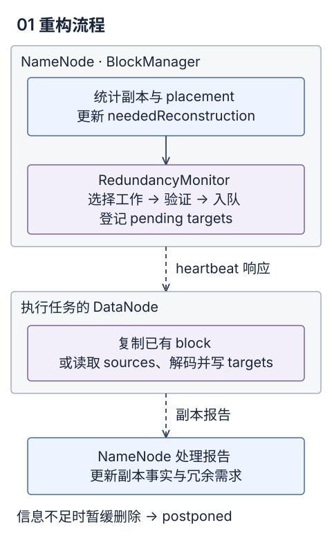
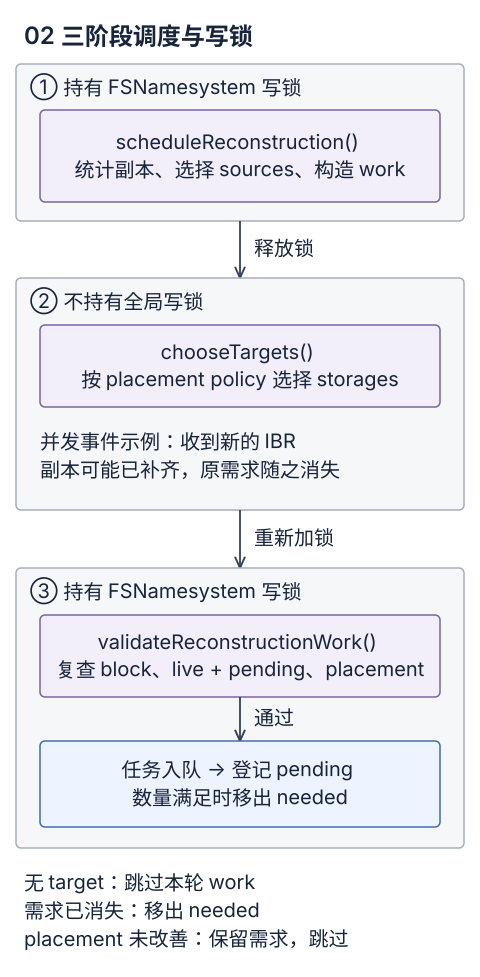
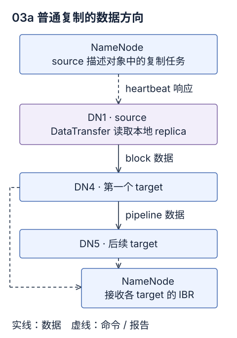
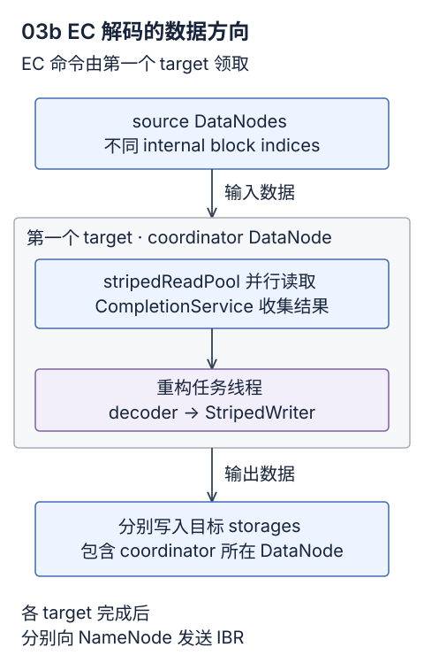
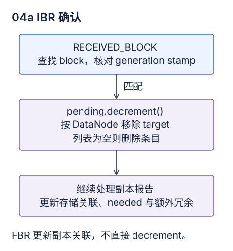
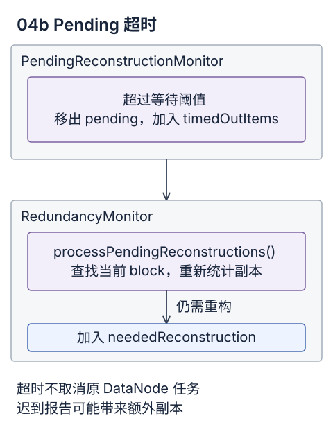
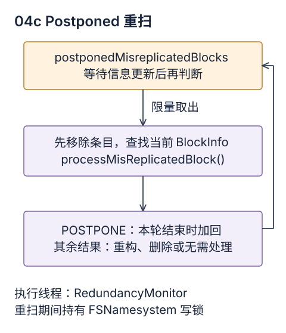

> 源码版本：Apache Hadoop 3.4.1。本文讨论 block 写入完成后的冗余维护；写入期间的 pipeline recovery、lease recovery 和 `BlockRecoveryWorker` 不在此范围内。

## 1. 重构流程与核心对象

DataNode 故障、存储损坏、节点退出服务或副本数调整，都可能使 block 的现有冗余不再满足要求。NameNode 负责统计副本、选择重构任务和安排执行节点；DataNode 负责复制数据或恢复 EC internal blocks，并通过 block report 汇报结果。



`BlocksMap` 保存 NameNode 已知的 block 元数据及其 storage 关联。普通 block 由 `BlockInfoContiguous` 表示，多份 replica 对应同一个逻辑 block；EC block group 由 `BlockInfoStriped` 表示，副本还要按 internal block index 区分。`NumberReplicas` 则是根据这些关联和节点状态计算出的分类统计。

`BlockManager` 使用三个容器维护重构需求和待处理记录：

<div class="[&_code]:wrap-anywhere [&_table]:w-full [&_table]:table-fixed">

| 字段                           | 类型与用途                                                                                                 |
| ------------------------------ | ---------------------------------------------------------------------------------------------------------- |
| `neededReconstruction`         | `LowRedundancyBlocks`；按优先级保存需要补充冗余或改善 placement 的 block/group，以及当前恢复输入不足的条目 |
| `pendingReconstruction`        | `PendingReconstructionBlocks`；以 block/group 为 key，记录等待确认的 targets 和最近登记时间                |
| `postponedMisreplicatedBlocks` | `LinkedHashSet<Block>`；保存需要等待信息更新后重新判断的 block，主要涉及安全删除                           |

</div>

容器和 `DatanodeDescriptor` 中的任务队列都位于 NameNode 内存。`BlockReconstructionWork` 是一次调度中的临时对象，验证通过后才会把任务放入相应 DataNode 描述对象的队列；远端 DataNode 在后续 heartbeat 响应中领取命令。

源码：[BlockManager.java:363](https://github.com/apache/hadoop/blob/rel/release-3.4.1/hadoop-hdfs-project/hadoop-hdfs/src/main/java/org/apache/hadoop/hdfs/server/blockmanagement/BlockManager.java#L363-L391)、[DatanodeDescriptor.java:196](https://github.com/apache/hadoop/blob/rel/release-3.4.1/hadoop-hdfs-project/hadoop-hdfs/src/main/java/org/apache/hadoop/hdfs/server/blockmanagement/DatanodeDescriptor.java#L196-L205)。

## 2. 重构需求的发现与维护

### 2.1 副本分类统计

`countNodes()` 遍历 block 关联的 storages，调用 `checkReplicaOnStorage()` 统计副本。判定同时涉及 storage 状态、DataNode 管理状态、损坏记录和多余副本记录。

<div class="overflow-x-auto [&_table]:min-w-[36rem]" role="region" aria-label="副本分类（窄屏可横向滚动）" tabindex="0">

| 分类                                 | 判定含义                                               |
| ------------------------------------ | ------------------------------------------------------ |
| `LIVE`                               | 正常参与冗余统计的副本                                 |
| `READONLY`                           | 位于 `READ_ONLY_SHARED` storage 的副本，可作为读取来源 |
| `DECOMMISSIONING` / `DECOMMISSIONED` | 所在节点正在退出服务／已退出服务                       |
| `MAINTENANCE_FOR_READ`               | 节点处于 entering-maintenance 且仍存活，允许读取       |
| `MAINTENANCE_NOT_FOR_READ`           | 节点已进入 maintenance，或已不可读                     |
| `CORRUPT`                            | 已记录为损坏的副本                                     |
| `EXCESS`                             | 已被选为多余副本，等待删除                             |
| `STALESTORAGE`                       | storage 的块清单尚未被视为新鲜，影响删除判断           |
| `REDUNDANT`                          | EC 中同一 internal block 的重复副本                    |

</div>

`STALESTORAGE` 是额外计数，一个 replica 可以同时计入 `LIVE` 和 `STALESTORAGE`。EC 路径还通过 `countLiveAndDecommissioningReplicas()` 按 index 去重：同一 internal block 的两份副本不能作为两个独立的解码输入。

源码：[BlockManager.java:4690](https://github.com/apache/hadoop/blob/rel/release-3.4.1/hadoop-hdfs-project/hadoop-hdfs/src/main/java/org/apache/hadoop/hdfs/server/blockmanagement/BlockManager.java#L4690-L4813)。

### 2.2 数量与 placement 判定

`isNeededReconstruction()` 要求 block 已 complete，并检查有效副本数和 placement。以下为保留判定条件的伪代码：

```text
required = max(expected - maintenanceReplicas, minimumLive)
effective = liveReplicas + pendingTargets

enough = effective >= required
         && (pendingTargets > 0 || placementSatisfied)
needed = block.isComplete() && !enough
```

普通 block 的 `expected` 是文件配置的副本数，EC 则使用 `getRealTotalBlockNum()`。`minimumLive` 对普通 block 取 maintenance 最小副本数与文件副本数的较小值，对 EC 取 `getRealDataBlockNum()`，短 block group 因而可能小于 EC policy 的 data unit 数。

pending targets 暂时计入有效副本；当数量已足够且仍有 pending 时，调度先等待报告，避免重复安排工作。没有 pending 后，placement 仍不满足也会触发重构，例如向新的 rack 补一份副本。

源码：[BlockManager.java:1147](https://github.com/apache/hadoop/blob/rel/release-3.4.1/hadoop-hdfs-project/hadoop-hdfs/src/main/java/org/apache/hadoop/hdfs/server/blockmanagement/BlockManager.java#L1147-L1153)、[BlockManager.java:2219](https://github.com/apache/hadoop/blob/rel/release-3.4.1/hadoop-hdfs-project/hadoop-hdfs/src/main/java/org/apache/hadoop/hdfs/server/blockmanagement/BlockManager.java#L2219-L2226)、[BlockManager.java:5134](https://github.com/apache/hadoop/blob/rel/release-3.4.1/hadoop-hdfs-project/hadoop-hdfs/src/main/java/org/apache/hadoop/hdfs/server/blockmanagement/BlockManager.java#L5134-L5163)。

### 2.3 初始化扫描与运行期更新

`initializeReplQueues()` 通过 `processMisReplicatedBlocks()` 启动 `Reconstruction Queue Initializer`。初始化线程分批持有 FSNamesystem 写锁，遍历 `BlocksMap` 并调用 `processMisReplicatedBlock()`；批次之间释放锁，避免长时间阻塞其他 namespace 操作。

`processMisReplicatedBlock()` 按以下顺序处理：

1. block 已不属于文件：加入 invalidation，返回 `INVALID`。
2. block 未 complete：返回 `UNDER_CONSTRUCTION`。
3. 需要重构且成功加入 needed：返回 `UNDER_REPLICATED`。
4. 需要处理额外冗余：能安全处理则返回 `OVER_REPLICATED`，否则返回 `POSTPONE`。
5. 其余情况返回 `OK`。

初始化扫描的调用方将 `POSTPONE` 结果放入 postponed。运行期间，副本报告、节点失效、副本数修改，以及 decommission/maintenance 处理会沿各自入口更新冗余需求。报告路径中的 `addStoredBlock()`、`updateNeededReconstructions()` 负责维护 needed，无需等待下一次全量扫描。

初始化标志在启动异步扫描后便置为 true，扫描是否结束需结合 `ReconstructionQueuesInitProgress` 判断。队列初始化与任务下发的运行条件也不同：非 HA 场景可以在 SafeMode 达到初始化阈值后开始扫描，`computeDatanodeWork()` 则在 SafeMode 中直接返回。

源码：[BlockManager.java:3830](https://github.com/apache/hadoop/blob/rel/release-3.4.1/hadoop-hdfs-project/hadoop-hdfs/src/main/java/org/apache/hadoop/hdfs/server/blockmanagement/BlockManager.java#L3830-L3858)、[BlockManager.java:3927](https://github.com/apache/hadoop/blob/rel/release-3.4.1/hadoop-hdfs-project/hadoop-hdfs/src/main/java/org/apache/hadoop/hdfs/server/blockmanagement/BlockManager.java#L3927-L4058)、[BlockManager.java:4120](https://github.com/apache/hadoop/blob/rel/release-3.4.1/hadoop-hdfs-project/hadoop-hdfs/src/main/java/org/apache/hadoop/hdfs/server/blockmanagement/BlockManager.java#L4120-L4154)、[BlockManager.java:5504](https://github.com/apache/hadoop/blob/rel/release-3.4.1/hadoop-hdfs-project/hadoop-hdfs/src/main/java/org/apache/hadoop/hdfs/server/blockmanagement/BlockManager.java#L5504-L5518)。

### 2.4 优先级与候选遍历

`LowRedundancyBlocks` 内部使用五个 `LightWeightLinkedSet<BlockInfo>`。普通 block 的主要分类如下，前提是该 block 已需要重构：

<div class="overflow-x-auto [&_table]:min-w-[36rem]" role="region" aria-label="重构优先级（窄屏可横向滚动）" tabindex="0">

| 优先级                             | 普通 block 的判定                                            |
| ---------------------------------- | ------------------------------------------------------------ |
| `QUEUE_HIGHEST_PRIORITY`           | 仅剩 1 份 live；或没有 live，但仍有 out-of-service／只读副本 |
| `QUEUE_VERY_LOW_REDUNDANCY`        | `live * 3 < expected`，且未命中最高优先级                    |
| `QUEUE_LOW_REDUNDANCY`             | 其余数量不足的情况                                           |
| `QUEUE_REPLICAS_BADLY_DISTRIBUTED` | live 数量达到 expected，但 placement 不满足                  |
| `QUEUE_WITH_CORRUPT_BLOCKS`        | 没有 live，也没有上述其他恢复来源                            |

</div>

EC 使用不同的风险阈值。令 `k = getRealDataBlockNum()`、`m = getParityBlockNum()`：live 等于 k 时已无额外容错，属于最高优先级；live 小于 k，但加上 out-of-service 副本仍达到 k，也归入最高优先级；恢复输入仍不足则归入 corrupt queue。其余低冗余 group 使用 `(live - k) * 3 < m + 1` 区分 very-low 与普通 low。

`chooseLowRedundancyBlocks()` 从各集合的 bookmark 继续遍历，达到预算便停止。**corrupt queue 会被扫描以清理已删除条目，但不会加入返回的重构候选列表。** 遍历到最后一级或达到配置的重置条件时，bookmark 回到队头。选为候选只推进遍历位置，具体移除发生在后续状态检查中。

源码：[LowRedundancyBlocks.java:211](https://github.com/apache/hadoop/blob/rel/release-3.4.1/hadoop-hdfs-project/hadoop-hdfs/src/main/java/org/apache/hadoop/hdfs/server/blockmanagement/LowRedundancyBlocks.java#L211-L284)、[LowRedundancyBlocks.java:517](https://github.com/apache/hadoop/blob/rel/release-3.4.1/hadoop-hdfs-project/hadoop-hdfs/src/main/java/org/apache/hadoop/hdfs/server/blockmanagement/LowRedundancyBlocks.java#L517-L559)。

## 3. RedundancyMonitor 的调度过程

### 3.1 运行条件与每轮预算

`BlockManager.activate()` 启动 `RedundancyMonitor`；`PendingReconstructionBlocks.start()` 另行启动 pending 超时检查线程。`RedundancyMonitor` 的每轮调用顺序如下，省略异常退出处理和时间戳更新：

```text
isPopulatingReplQueues()
  → computeDatanodeWork()
  → processPendingReconstructions()
  → rescanPostponedMisreplicatedBlocks()
  → processTimedOutExcessBlocks()
sleep(redundancyRecheckIntervalMs)
```

`isPopulatingReplQueues()` 检查 HA state 与队列初始化标志。通过后，`computeDatanodeWork()` 再检查 SafeMode，并分别计算重构和删除工作预算：

```text
候选扫描预算 = live DataNode 数 × blocksReplWorkMultiplier
删除节点预算 = ceil(live DataNode 数 × blocksInvalidateWorkPct)
```

候选可能因没有 source、找不到 target 或需求已消失而无法生成任务，实际成功调度数可能小于扫描预算。轮次间隔还包含本轮处理耗时，并非固定频率定时器。

源码：[BlockManager.java:5338](https://github.com/apache/hadoop/blob/rel/release-3.4.1/hadoop-hdfs-project/hadoop-hdfs/src/main/java/org/apache/hadoop/hdfs/server/blockmanagement/BlockManager.java#L5338-L5407)。

### 3.2 候选选择与锁边界

`computeBlockReconstructionWork()` 在写锁下选出候选，再进入 `computeReconstructionWorkForBlocks()`。后者分三批处理：先为候选构造 work，释放锁后选择 targets，最后重新加锁逐项验证并登记任务。



选择 targets 期间，block 可能被删除、重新打开 append，或已收到其他副本报告。最终验证必须重新读取这些条件，不能直接使用第一阶段的统计结果。

源码：[BlockManager.java:2094](https://github.com/apache/hadoop/blob/rel/release-3.4.1/hadoop-hdfs-project/hadoop-hdfs/src/main/java/org/apache/hadoop/hdfs/server/blockmanagement/BlockManager.java#L2094-L2216)。

### 3.3 Source 选择与 work 构造

`scheduleReconstruction()` 先移除已删除或不再满足 `isCompleteOrCommitted()` 的 block，再调用 `chooseSourceDatanodes()`。该方法遍历关联 storages，在统计副本的同时选择 source：损坏、excess 和不可读 maintenance 副本被排除；普通复制通常选一个 source，EC 收集多个 source 及其 internal block indices。

source 选择受 soft/hard limit 约束。检查值为 `getNumberOfBlocksToBeReplicated() + getNumberOfBlocksToBeErasureCoded()`，包含描述对象中的排队工作；普通复制计数还包含尚未选出 targets 的预留工作。最高优先级和正在退出服务的节点可突破 soft limit，常规选择仍受 hard limit 限制。普通 block 在没有其他来源时，还可能使用存活的 decommissioned 副本兜底。

随后计算有效副本和缺口。若已满足要求，移出 needed；否则构造 `ReplicationWork` 或 `ErasureCodingWork`。EC 还检查 source 数量、调整 index 顺序，并记录忙碌节点上的 indices，避免把已有但繁忙的 internal block 当成缺失块；已有 pending targets 时，本轮等待原重构。

`ReplicationWork` 构造时增加 source 的 `pendingReplicationWithoutTargets`，在 `chooseTargets()` 的 `finally` 中减回。这样，同一批尚未入队的普通复制工作也参与 source 压力估计。

源码：[BlockManager.java:2230](https://github.com/apache/hadoop/blob/rel/release-3.4.1/hadoop-hdfs-project/hadoop-hdfs/src/main/java/org/apache/hadoop/hdfs/server/blockmanagement/BlockManager.java#L2230-L2352)、[BlockManager.java:2560](https://github.com/apache/hadoop/blob/rel/release-3.4.1/hadoop-hdfs-project/hadoop-hdfs/src/main/java/org/apache/hadoop/hdfs/server/blockmanagement/BlockManager.java#L2560-L2673)、[ReplicationWork.java:26](https://github.com/apache/hadoop/blob/rel/release-3.4.1/hadoop-hdfs-project/hadoop-hdfs/src/main/java/org/apache/hadoop/hdfs/server/blockmanagement/ReplicationWork.java#L26-L66)、[DatanodeDescriptor.java:741](https://github.com/apache/hadoop/blob/rel/release-3.4.1/hadoop-hdfs-project/hadoop-hdfs/src/main/java/org/apache/hadoop/hdfs/server/blockmanagement/DatanodeDescriptor.java#L741-L751)。

### 3.4 锁外选择 targets

`chooseTargets()` 使用 block type 对应的 `BlockPlacementPolicy`。排除集合包含现有副本所在节点和已登记的 pending targets，再结合 storage policy、拓扑、剩余空间及负载选择目标 storages；rack 或 upgrade domain 的具体约束取决于启用的 placement policy。

这一步不持有 FSNamesystem 全局写锁。它只填写 work 的 targets，尚未下发任务；没有选到 target 的 work 会在第三阶段被跳过。

源码：[BlockManager.java:2157](https://github.com/apache/hadoop/blob/rel/release-3.4.1/hadoop-hdfs-project/hadoop-hdfs/src/main/java/org/apache/hadoop/hdfs/server/blockmanagement/BlockManager.java#L2157-L2198)。

### 3.5 重新验证与任务登记

`validateReconstructionWork()` 再次检查 block 状态和 live + pending。对于数量足够但 placement 不满足的 block，还要求新 targets 至少减少 placement 所需的额外副本数。验证通过后，在同一段写锁内执行：

```text
work.addTaskToDatanode()
  → 增加 targets 的 blocksScheduled
  → pendingReconstruction.increment(block, targets)
  → 若 live + 原 pending + 新 targets 已足够，移出 needed
```

`scheduledWork` 对每个成功 work 加 1。任务留在 NameNode 的节点队列中，直到 heartbeat 处理路径取出；报告确认之前，pending 记录持续存在。

源码：[BlockManager.java:2355](https://github.com/apache/hadoop/blob/rel/release-3.4.1/hadoop-hdfs-project/hadoop-hdfs/src/main/java/org/apache/hadoop/hdfs/server/blockmanagement/BlockManager.java#L2355-L2414)。

## 4. DataNode 的复制与 EC 重构

### 4.1 命令领取与执行分支

三种工作使用不同的节点队列，队列均属于 NameNode 中的 `DatanodeDescriptor`：

<div class="overflow-x-auto [&_table]:min-w-[42rem]" role="region" aria-label="任务队列与执行节点" tabindex="0">

| 工作                       | 队列 / 元素                                              | 领取命令的 DataNode             | 命令                                |
| -------------------------- | -------------------------------------------------------- | ------------------------------- | ----------------------------------- |
| 普通 block 复制            | `replicateBlocks` / `BlockTargetPair`                    | source                          | `DNA_TRANSFER`                      |
| EC internal block 直接复制 | `ecBlocksToBeReplicated` / `BlockTargetPair`             | source                          | `DNA_TRANSFER`                      |
| EC 解码重构                | `ecBlocksToBeErasureCoded` / `BlockECReconstructionInfo` | 第一个 target，作为 coordinator | `DNA_ERASURE_CODING_RECONSTRUCTION` |

</div>

`DatanodeManager.handleHeartbeat()` 根据 DataNode 上报的 `xmitsInProgress` 和可用传输预算，从这些队列按比例取任务。source 筛选阶段的队列限流与 heartbeat 阶段的命令预算分别生效；任务入队后仍可能等待若干轮 heartbeat。

`ErasureCodingWork.addTaskToDatanode()` 根据任务条件选择直接复制或解码：internal blocks 齐全但 rack 不足时复制一块到新 rack；存在退出服务的节点且 internal blocks 齐全时，复制需要迁出的块；其余情况把 EC 重构命令放入第一个 target 的队列。

源码：[DatanodeManager.java:1853](https://github.com/apache/hadoop/blob/rel/release-3.4.1/hadoop-hdfs-project/hadoop-hdfs/src/main/java/org/apache/hadoop/hdfs/server/blockmanagement/DatanodeManager.java#L1853-L1920)、[ErasureCodingWork.java:138](https://github.com/apache/hadoop/blob/rel/release-3.4.1/hadoop-hdfs-project/hadoop-hdfs/src/main/java/org/apache/hadoop/hdfs/server/blockmanagement/ErasureCodingWork.java#L138-L177)。

### 4.2 普通复制的数据路径

`BPOfferService.processCommandFromActive()` 收到 `DNA_TRANSFER` 后调用 `DataNode.transferBlocks()`。每个 block 由 `DataTransfer` 线程读取 source 本地 replica，连接第一个 target；后续 targets 通过 pipeline 接收数据。



图中实线表示 block 数据，虚线表示 heartbeat 命令或副本报告。EC internal block 直接复制也走此路径，传输对象是已有的 internal block。

源码：[BPOfferService.java:729](https://github.com/apache/hadoop/blob/rel/release-3.4.1/hadoop-hdfs-project/hadoop-hdfs/src/main/java/org/apache/hadoop/hdfs/server/datanode/BPOfferService.java#L729-L733)、[DataNode.java:2895](https://github.com/apache/hadoop/blob/rel/release-3.4.1/hadoop-hdfs-project/hadoop-hdfs/src/main/java/org/apache/hadoop/hdfs/server/datanode/DataNode.java#L2895-L2907)。

### 4.3 EC 任务与读写初始化

收到 EC 命令后，`ErasureCodingWorker.processErasureCodingTasks()` 将 block group、EC policy、source/index 对应关系、targets 及 storage 信息封装为 `StripedReconstructionInfo`，构造 `StripedBlockReconstructor`。存在有效目标时，任务提交到 `stripedReconstructionPool`。

任务提交后即增加加权的 `xmitsInProgress`，排队中的 EC 工作也计入负载。权重基于最少输入数与 target 数的较大值计算，最小贡献为 1；该值供后续 heartbeat 分配预算使用。

`StripedBlockReconstructor.run()` 依次初始化 decoder、可选的解码校验器、reader 和 writer，再进入重构循环。两类初始化承担不同职责：

- **`StripedReader.init()`：** 建立足够数量的 source readers，从 reader 获取 checksum 参数，将读 buffer 大小对齐到 checksum chunk。短 block group 中长度为零的数据块使用零填充输入，因此最少实际输入数可能小于 policy 的 k。
- **`StripedWriter`：** 构造时根据 live/excluded indices 和 internal block 长度确定待恢复 indices，计算 `maxTargetLength`；`init()` 再准备 packet/checksum buffers，为每个 target 建立写连接。每个 writer 对应一个 internal block。

输入数组的下标是 internal block index；source 列表位置通过 `liveIndices` 映射到这个下标。输出 indices 则由 writer 根据缺失位置生成，与 targets 按顺序对应。

源码：[ErasureCodingWorker.java:106](https://github.com/apache/hadoop/blob/rel/release-3.4.1/hadoop-hdfs-project/hadoop-hdfs/src/main/java/org/apache/hadoop/hdfs/server/datanode/erasurecode/ErasureCodingWorker.java#L106-L157)、[StripedReader.java:88](https://github.com/apache/hadoop/blob/rel/release-3.4.1/hadoop-hdfs-project/hadoop-hdfs/src/main/java/org/apache/hadoop/hdfs/server/datanode/erasurecode/StripedReader.java#L88-L212)、[StripedWriter.java:68](https://github.com/apache/hadoop/blob/rel/release-3.4.1/hadoop-hdfs-project/hadoop-hdfs/src/main/java/org/apache/hadoop/hdfs/server/datanode/erasurecode/StripedWriter.java#L68-L142)。

### 4.4 并行读取、解码与写入

coordinator 在一个重构任务线程中推进循环，source 读取交给独立的 `stripedReadPool`，通过 `ExecutorCompletionService` 收集结果。解码和输出发送回到重构任务线程执行。



每轮长度为 `min(bufferSize, maxTargetLength - positionInBlock)`。以下为执行顺序的伪代码：

```text
while positionInBlock < maxTargetLength:
    length = min(bufferSize, maxTargetLength - positionInBlock)
    readMinimumSources(length)
    inputs = getInputBuffers(length)
    outputs = decode(inputs, activeTargetIndices)
    按各 target 的剩余长度截断 outputs
    transferData2Targets()
    positionInBlock += length
    clearBuffers()
```

**读取。** `readMinimumSources()` 优先使用上一轮的 `successList`。某个读取失败时关闭对应 reader，并从其余来源补读；等待超时也会尝试其他来源。凑齐最少输入后，取消尚未完成的读取 Future，并清理本轮 completion 结果。无法取得足够输入则抛出 `IOException`；检测到的 corrupt block 会向 NameNode 报告。

**解码。** `getInputBuffers()` 按 index 放置成功读取的 buffers，对短输入补零，未提供的输入保持为空。decoder 按 writer 给出的 `erasedIndices` 生成输出。开启解码校验时，输出还经过 `DecodingValidator`，校验失败会终止本次任务。

**写入。** `StripedBlockWriter` 为输出计算 checksum 并组装 `DFSPacket`，通过独立连接发送到对应 target。不同 internal blocks 的长度可能不同，已到末尾的 target 不再发送本轮数据。读写两侧还分别执行配置的 reconstruction throttler。

源码：[ErasureCodingWorker.java:75](https://github.com/apache/hadoop/blob/rel/release-3.4.1/hadoop-hdfs-project/hadoop-hdfs/src/main/java/org/apache/hadoop/hdfs/server/datanode/erasurecode/ErasureCodingWorker.java#L75-L113)、[StripedReader.java:221](https://github.com/apache/hadoop/blob/rel/release-3.4.1/hadoop-hdfs-project/hadoop-hdfs/src/main/java/org/apache/hadoop/hdfs/server/datanode/erasurecode/StripedReader.java#L221-L351)、[StripedBlockReconstructor.java:90](https://github.com/apache/hadoop/blob/rel/release-3.4.1/hadoop-hdfs-project/hadoop-hdfs/src/main/java/org/apache/hadoop/hdfs/server/datanode/erasurecode/StripedBlockReconstructor.java#L90-L174)、[StripedBlockWriter.java:164](https://github.com/apache/hadoop/blob/rel/release-3.4.1/hadoop-hdfs-project/hadoop-hdfs/src/main/java/org/apache/hadoop/hdfs/server/datanode/erasurecode/StripedBlockWriter.java#L164-L215)。

### 4.5 部分失败与任务结束

`StripedWriter` 用 `targetsStatus` 记录各 target 是否仍可写。连接或传输失败的 target 被排除，后续只为剩余 targets 解码和发送；所有 targets 失败时，初始化或重构循环抛出异常。这允许一个任务只完成部分 internal blocks。

循环结束后，`endTargetBlocks()` 向仍有效的 targets 发送结束 packet。此路径不逐包等待 ACK，因此任务线程返回不能代替 NameNode 收到副本报告。未得到报告的 targets 由 pending 超时路径继续处理。

`run()` 捕获失败并更新任务指标，在 `finally` 中减回加权传输计数、关闭 reader/writer、归还其持有的 buffers，并释放 decoder。source 读失败时的补读发生在 DataNode 内部；pending 超时后的重新调度发生在 NameNode，两者的处理范围不同。

源码：[StripedWriter.java:147](https://github.com/apache/hadoop/blob/rel/release-3.4.1/hadoop-hdfs-project/hadoop-hdfs/src/main/java/org/apache/hadoop/hdfs/server/datanode/erasurecode/StripedWriter.java#L147-L195)、[StripedWriter.java:310](https://github.com/apache/hadoop/blob/rel/release-3.4.1/hadoop-hdfs-project/hadoop-hdfs/src/main/java/org/apache/hadoop/hdfs/server/datanode/erasurecode/StripedWriter.java#L310-L325)、[StripedBlockReconstructor.java:53](https://github.com/apache/hadoop/blob/rel/release-3.4.1/hadoop-hdfs-project/hadoop-hdfs/src/main/java/org/apache/hadoop/hdfs/server/datanode/erasurecode/StripedBlockReconstructor.java#L53-L86)、[StripedReconstructor.java:295](https://github.com/apache/hadoop/blob/rel/release-3.4.1/hadoop-hdfs-project/hadoop-hdfs/src/main/java/org/apache/hadoop/hdfs/server/datanode/erasurecode/StripedReconstructor.java#L295-L299)。

以完整 RS-6-3 group 为例：丢失 index 2 后仍有 8 个不同 indices。coordinator 正常情况下读取其中 6 个输入，在每轮 buffer 上恢复 index 2，再写入对应 target；多出的来源供失败或慢读时替换。若只剩 5 个独立输入，且退出服务的节点上也没有可用来源，该 group 会进入 corrupt queue，增加 targets 或调度预算无法补足解码输入。

## 5. 报告确认、超时与延迟处理

### 5.1 Pending 登记与报告确认

`PendingReconstructionBlocks` 内部为 `Map<BlockInfo, PendingBlockInfo>`，value 保存 target storage 列表和时间戳。`increment()` 首次建立条目；追加 targets 时去重并刷新整个条目的时间戳。

除了后台重构，写入收尾也会通过 `addExpectedReplicasToPending()` 登记尚未报告的预期副本。EC 的这一入口还要求 expected storages 数量等于 `getRealTotalBlockNum()`。



处理 `RECEIVED_BLOCK` 时，`BlockManager.addBlock()` 先查找当前 block 并核对 generation stamp，再调用 `pendingReconstruction.decrement()`；该方法按报告所属 DataNode 移除 target 记录，列表为空则删除 map 条目。随后报告处理更新存储关联，并按当前冗余维护 needed 和额外副本。

FBR 也能更新实际副本关联，但不直接执行此处的 pending decrement。若 IBR 丢失，pending 可一直保留到超时，届时再依据 FBR 已更新的事实判断是否仍需重构。

源码：[PendingReconstructionBlocks.java:92](https://github.com/apache/hadoop/blob/rel/release-3.4.1/hadoop-hdfs-project/hadoop-hdfs/src/main/java/org/apache/hadoop/hdfs/server/blockmanagement/PendingReconstructionBlocks.java#L92-L129)、[PendingReconstructionBlocks.java:227](https://github.com/apache/hadoop/blob/rel/release-3.4.1/hadoop-hdfs-project/hadoop-hdfs/src/main/java/org/apache/hadoop/hdfs/server/blockmanagement/PendingReconstructionBlocks.java#L227-L246)、[BlockManager.java:1252](https://github.com/apache/hadoop/blob/rel/release-3.4.1/hadoop-hdfs-project/hadoop-hdfs/src/main/java/org/apache/hadoop/hdfs/server/blockmanagement/BlockManager.java#L1252-L1274)、[BlockManager.java:4510](https://github.com/apache/hadoop/blob/rel/release-3.4.1/hadoop-hdfs-project/hadoop-hdfs/src/main/java/org/apache/hadoop/hdfs/server/blockmanagement/BlockManager.java#L4510-L4540)。

普通 block B 的目标副本数为 3，DN2、DN3 失效后只剩 DN1。假设 placement 正常，调度一次找到 DN4、DN5，容器变化如下：

<div class="overflow-x-auto [&_table]:min-w-[38rem]" role="region" aria-label="block B 的报告与计数变化" tabindex="0">

| 事件                 | live | pending targets | needed 条目 | pending 条目 |
| -------------------- | ---- | --------------- | ----------- | ------------ |
| 已处理 DN2、DN3 丢失 | 1    | 无              | 1           | 0            |
| 安排 DN4、DN5        | 1    | DN4、DN5        | 0           | 1            |
| 接受 DN4 的 IBR      | 2    | DN5             | 0           | 1            |
| 接受 DN5 的 IBR      | 3    | 无              | 0           | 0            |

</div>

这次调度贡献 1 个 work、2 个 pending targets 和 1 个 pending 条目。若只找到 DN4，则 needed 与 pending 条目均为 1，B 同时存在于两个容器中。

### 5.2 Pending 超时与重新调度

独立的 `PendingReconstructionMonitor` 扫描 pending map。条目的等待时间超过 timeout 后，将 block 加入 `timedOutItems` 并移出 pending；扫描间隔取默认检查间隔与 timeout 的较小值。



`RedundancyMonitor.processPendingReconstructions()` 消费超时列表，在写锁下从 `BlocksMap` 查找当前 `BlockInfo`，跳过已删除 block，再统计副本、判断是否重新加入 needed。由于本轮 `computeDatanodeWork()` 在前，新加入的需求通常要等后续轮次调度。

超时处理不向 DataNode 发送取消命令。原任务可能仍在执行，新的 work 也可能已被安排；迟到报告按当前 block 事实处理，多出的副本进入额外冗余处理。若报告已证明副本足够，超时复查便不会重新加入 needed。

源码：[PendingReconstructionBlocks.java:260](https://github.com/apache/hadoop/blob/rel/release-3.4.1/hadoop-hdfs-project/hadoop-hdfs/src/main/java/org/apache/hadoop/hdfs/server/blockmanagement/PendingReconstructionBlocks.java#L260-L303)、[BlockManager.java:2680](https://github.com/apache/hadoop/blob/rel/release-3.4.1/hadoop-hdfs-project/hadoop-hdfs/src/main/java/org/apache/hadoop/hdfs/server/blockmanagement/BlockManager.java#L2680-L2707)。

### 5.3 Postponed 重扫与 failover

failover 后，新 Active 看到的 storage 清单可能尚未反映旧 Active 下发的删除。如果立即按旧清单继续选择 excess replica，可能造成过度删除。`postponedMisreplicatedBlocks` 暂存这类无法安全处理的 block；corrupt replica 的删除也可能因其他 storage 信息 stale 而被推迟。

`DatanodeStorageInfo.markStaleAfterFailover()` 将块清单标为 stale。收到 heartbeat 只设置 `heartbeatedSinceFailover`；其后的 `receivedBlockReport()` 才清除 `blockContentsStale`。



`rescanPostponedMisreplicatedBlocks()` 在写锁下限量取出条目，并先从集合移除。取得当前 `BlockInfo` 后调用 `processMisReplicatedBlock()`；仍返回 `POSTPONE` 的条目暂存到重扫集合，在本轮结束时加回。其他结果由分类路径处理，可能加入 needed、安排删除，或无需进一步操作。

needed、pending 和 postponed 都是内存记录。NameNode 重启或角色切换后的冗余维护依靠 namespace、block reports 和队列初始化重新建立当前需求，不能依赖旧调度记录继续执行。

源码：[DatanodeStorageInfo.java:184](https://github.com/apache/hadoop/blob/rel/release-3.4.1/hadoop-hdfs-project/hadoop-hdfs/src/main/java/org/apache/hadoop/hdfs/server/blockmanagement/DatanodeStorageInfo.java#L184-L200)、[BlockManager.java:3025](https://github.com/apache/hadoop/blob/rel/release-3.4.1/hadoop-hdfs-project/hadoop-hdfs/src/main/java/org/apache/hadoop/hdfs/server/blockmanagement/BlockManager.java#L3025-L3064)。

## 附录：指标与配置

### A. 指标口径

下表使用 Hadoop 3.4.1 `FSNamesystem` 暴露的名称。`BlockManager.updateState()` 将 needed/pending 大小复制到指标字段，因此监控值不是每次容器增删的即时回读。一次抓取中的多个指标也不构成跨容器的原子快照。

<div class="overflow-x-auto [&_table]:min-w-[48rem]" role="region" aria-label="重构指标速查（窄屏可横向滚动）" tabindex="0">

| 指标                                | 主体与计数口径                                                                                          | 读数含义                                                                                               |
| ----------------------------------- | ------------------------------------------------------------------------------------------------------- | ------------------------------------------------------------------------------------------------------ |
| `LowRedundancyBlocks`               | `neededReconstruction.size()` 的快照；当前 block/group 条目数，五个优先级集合求和                       | 包括数量不足、placement 不满足及 corrupt queue；不是缺少的 replica 数                                  |
| `LowRedundancyReplicatedBlocks`     | needed 中普通 block 的分类计数，排除 corrupt queue；当前普通 block 数                                   | 与总量 `LowRedundancyBlocks` 口径不同                                                                  |
| `LowRedundancyECBlockGroups`        | needed 中 EC group 的分类计数，排除 corrupt queue；当前 block group 数                                  | 一个 group 缺多个 internal blocks 仍计 1                                                               |
| `PendingReconstructionBlocks`       | `pendingReconstruction.size()` 的快照；当前 block/group key 数                                          | 一个 key 下多个 targets 仍计 1；既包含后台重构 targets，也包含写入收尾等待 IBR 的预期副本              |
| `ScheduledReplicationBlocks`        | 最近一次更新该值的调度轮次返回的 `scheduledWork`；每轮安排成功的 work 数，普通 block 与 EC group 都包含 | 不是累计完成数，也不是当前传输并发；一项 work 可有多个 targets                                         |
| `NumTimedOutPendingReconstructions` | `timedOutCount + timedOutItems.size()`；自启动或 clear() 后累计 pending entry 超时次数                  | 同一 block 重复超时会重复计数；看时间段增量，clear() 或重启后基线重置                                  |
| `PostponedMisreplicatedBlocks`      | `postponedMisreplicatedBlocks.size()`；当前待重扫的 block 条目数                                        | 常见原因是 stale 信息阻碍安全删除，不代表复制带宽不足                                                  |
| `ReconstructionQueuesInitProgress`  | 初始化扫描的 processed / 初始 total，最大为 1；0–1 的扫描进度                                           | 不是修复完成率；空 namespace 不能仅靠该值判断初始化是否完成                                            |
| `ExcessBlocks`                      | `excessRedundancyMap.size()`；当前按 DataNode 记录的 excess 条目数                                      | 同一逻辑 block 在不同节点上的记录分别计数，不能当作唯一 block 数                                       |
| `PendingDeletionBlocks`             | `invalidateBlocks.numBlocks()`；当前 invalidation 容器中的删除条目数                                    | 普通 block 删除条目与 EC internal block 删除条目之和；移入节点命令队列时就可下降，不代表已删除落盘数据 |

</div>

源码入口：[指标 getter](https://github.com/apache/hadoop/blob/rel/release-3.4.1/hadoop-hdfs-project/hadoop-hdfs/src/main/java/org/apache/hadoop/hdfs/server/namenode/FSNamesystem.java#L5417-L5588)、[updateState()](https://github.com/apache/hadoop/blob/rel/release-3.4.1/hadoop-hdfs-project/hadoop-hdfs/src/main/java/org/apache/hadoop/hdfs/server/blockmanagement/BlockManager.java#L2057-L2061)、[每轮 scheduledWork](https://github.com/apache/hadoop/blob/rel/release-3.4.1/hadoop-hdfs-project/hadoop-hdfs/src/main/java/org/apache/hadoop/hdfs/server/blockmanagement/BlockManager.java#L5381-L5407)、[超时累计](https://github.com/apache/hadoop/blob/rel/release-3.4.1/hadoop-hdfs-project/hadoop-hdfs/src/main/java/org/apache/hadoop/hdfs/server/blockmanagement/PendingReconstructionBlocks.java#L174-L199)、[invalidation 队列转移](https://github.com/apache/hadoop/blob/rel/release-3.4.1/hadoop-hdfs-project/hadoop-hdfs/src/main/java/org/apache/hadoop/hdfs/server/blockmanagement/InvalidateBlocks.java#L260-L298)。

### B. Corrupt、Missing 与删除计数

除 needed/pending/postponed 外，`BlockManager` 还维护以下主体：

<div class="overflow-x-auto [&_table]:min-w-[48rem]" role="region" aria-label="副本事实与删除容器（窄屏可横向滚动）" tabindex="0">

| 字段 / 类型                                   | 内部保存的关系                                                            | 用途                               |
| --------------------------------------------- | ------------------------------------------------------------------------- | ---------------------------------- |
| `corruptReplicas` / `CorruptReplicasMap`      | `Block → (DatanodeDescriptor → Reason)`                                   | 记录哪个节点上的副本损坏及原因     |
| `excessRedundancyMap` / `ExcessRedundancyMap` | `DataNode UUID → Set<Block>`                                              | 记录已选为多余的 block-node 关联   |
| `invalidateBlocks` / `InvalidateBlocks`       | 两个 `DataNode → Set<Block>` map，分别保存普通 block 和 EC internal block | 保存待移交给节点命令队列的删除条目 |

</div>

<div class="overflow-x-auto [&_table]:min-w-[48rem]" role="region" aria-label="Corrupt Missing 与删除指标（窄屏可横向滚动）" tabindex="0">

| 指标                                                          | 统计主体                                                                       | 与相邻概念的区别                                                                           |
| ------------------------------------------------------------- | ------------------------------------------------------------------------------ | ------------------------------------------------------------------------------------------ |
| `CorruptReplicatedBlocks` / `CorruptECBlockGroups`            | `CorruptReplicasMap` 中有损坏副本记录的普通 block / EC group                   | 有坏副本不等于没有健康副本，也不等于已不可恢复；不是损坏 replica 的总数                    |
| `MissingReplicatedBlocks` / `MissingECBlockGroups`            | `LowRedundancyBlocks` 的 `QUEUE_WITH_CORRUPT_BLOCKS` 分类计数                  | 根据当前已知输入判断无法恢复；EC 不要求所有 internal blocks 都消失才记 missing             |
| `PendingDeletionReplicatedBlocks` / `PendingDeletionECBlocks` | `InvalidateBlocks` 中按 DataNode 保存的普通 block / EC internal block 删除条目 | EC 此处按 internal block 删除条目计数，不按 group 计数；二者相加为 `PendingDeletionBlocks` |

</div>

`CorruptReplicasMap` 记录坏副本事实；`LowRedundancyBlocks` 的 corrupt queue 表达恢复输入不足。两处名称都含 corrupt，含义却不同。例如 B 有一份 corrupt replica、两份健康 replica，可以计入 `CorruptReplicatedBlocks`，同时不计入 `MissingReplicatedBlocks`。相反，副本全部丢失但没有损坏报告的 block，可以计入 Missing 而没有对应的 Corrupt 记录。

同样，`excessRedundancyMap` 记录已选为多余的副本，`InvalidateBlocks` 记录待移交的删除工作。删除还可以来自文件删除或 corrupt replica 清理，两项指标不是相同集合，也不能相加代表未完成删除总数。

源码见 [CorruptReplicasMap](https://github.com/apache/hadoop/blob/rel/release-3.4.1/hadoop-hdfs-project/hadoop-hdfs/src/main/java/org/apache/hadoop/hdfs/server/blockmanagement/CorruptReplicasMap.java)、[LowRedundancyBlocks 分类及计数](https://github.com/apache/hadoop/blob/rel/release-3.4.1/hadoop-hdfs-project/hadoop-hdfs/src/main/java/org/apache/hadoop/hdfs/server/blockmanagement/LowRedundancyBlocks.java#L124-L284)、[ExcessRedundancyMap](https://github.com/apache/hadoop/blob/rel/release-3.4.1/hadoop-hdfs-project/hadoop-hdfs/src/main/java/org/apache/hadoop/hdfs/server/blockmanagement/ExcessRedundancyMap.java#L41-L90)。

### C. 配置作用范围

<div class="overflow-x-auto [&_table]:min-w-[48rem]" role="region" aria-label="重构配置速查（窄屏可横向滚动）" tabindex="0">

| 配置                                                     | Hadoop 3.4.1 默认值 | 作用阶段与边界                                                                  |
| -------------------------------------------------------- | ------------------- | ------------------------------------------------------------------------------- |
| `dfs.namenode.redundancy.interval.seconds`               | 3s                  | monitor 每轮工作后的休眠间隔，实际轮次还包含处理耗时                            |
| `dfs.namenode.replication.work.multiplier.per.iteration` | 2                   | 每轮候选 block 预算为 live DataNode 数 × multiplier；不保证成功安排同样多的任务 |
| `dfs.namenode.replication.max-streams`                   | 2                   | source 选择的 soft limit；最高优先级和退出服务场景可突破                        |
| `dfs.namenode.replication.max-streams-hard-limit`        | 4                   | source 选择的 hard limit；不是集群实际传输并发指标                              |
| `dfs.namenode.reconstruction.pending.timeout-sec`        | 300s                | pending entry 的等待阈值；还要经过扫描和后续处理，不是准时重试定时器            |
| `dfs.namenode.blocks.per.postponedblocks.rescan`         | 10000               | 每轮 postponed 重扫上限                                                         |
| `dfs.namenode.redundancy.queue.restart.iterations`       | 2400                | 控制低冗余队列 bookmark 重置到队头                                              |

</div>

默认值与语义见 [hdfs-default.xml](https://github.com/apache/hadoop/blob/rel/release-3.4.1/hadoop-hdfs-project/hadoop-hdfs/src/main/resources/hdfs-default.xml)。这些参数分别约束候选选择、source 压力、等待和重扫，不能互相替代。

### D. 排障组合

<div class="overflow-x-auto [&_table]:min-w-[48rem]" role="region" aria-label="排障指标组合（窄屏可横向滚动）" tabindex="0">

| 观察组合                                 | 优先核查                                                                            | 不能直接推出什么                        |
| ---------------------------------------- | ----------------------------------------------------------------------------------- | --------------------------------------- |
| LowRedundancy 上升，Scheduled 长期接近 0 | Active / SafeMode 与初始化状态，source/target 可选性，限流、placement，Missing 分类 | 不能仅凭 backlog 推断 DataNode 带宽不足 |
| Pending 长期高位，超时累计值持续增加     | 区分重构与写入收尾来源，再查命令领取延迟、DataNode 执行及 IBR 反馈                  | Pending 高不证明所有任务已经开始执行    |
| Postponed 长时间不下降                   | storage report 新鲜度、failover 后重扫与删除判断                                    | 增加复制并发未必有用                    |
| LowRedundancy 下降，Excess 上升          | 是否有超时重试、迟到任务、恢复上线的旧副本或 replication factor 变更                | 不能单凭两个趋势确定出现重复任务        |
| EC 工作持续安排，但完成慢                | coordinator 的 read、decode、write 耗时及负载                                       | NameNode 的 work multiplier 未必是瓶颈  |

</div>

## 参考资料

- [Apache Hadoop 3.4.1 source](https://github.com/apache/hadoop/tree/rel/release-3.4.1)
- [BlockManager.java](https://github.com/apache/hadoop/blob/rel/release-3.4.1/hadoop-hdfs-project/hadoop-hdfs/src/main/java/org/apache/hadoop/hdfs/server/blockmanagement/BlockManager.java)
- [LowRedundancyBlocks.java](https://github.com/apache/hadoop/blob/rel/release-3.4.1/hadoop-hdfs-project/hadoop-hdfs/src/main/java/org/apache/hadoop/hdfs/server/blockmanagement/LowRedundancyBlocks.java)
- [PendingReconstructionBlocks.java](https://github.com/apache/hadoop/blob/rel/release-3.4.1/hadoop-hdfs-project/hadoop-hdfs/src/main/java/org/apache/hadoop/hdfs/server/blockmanagement/PendingReconstructionBlocks.java)
- [HDFS 块重构和 RedundancyMonitor 详解](https://blog.csdn.net/zhanyuanlin/article/details/140335982)
